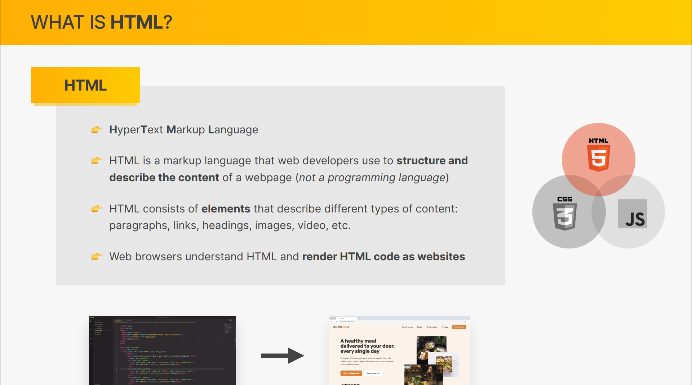
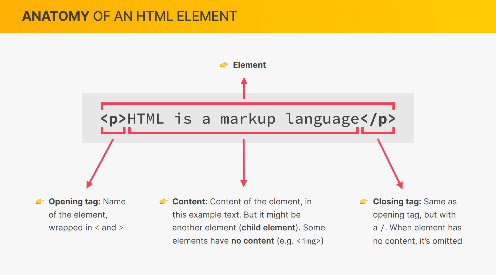

- [Introduction to HTML](#introduction-to-html)
- [HTML Document Structure](#html-document-structure)
- [Text Elements](#text-elements)
- [More Text Elements\_ Lists](#more-text-elements_-lists)
- [Images and Attributes](#images-and-attributes)
- [Hyperlinks](#hyperlinks)
- [Structuring our Page](#structuring-our-page)
- [A Note on Semantic HTML](#a-note-on-semantic-html)
- [Installing Additional VS Code Extensions](#installing-additional-vs-code-extensions)
- [CHALLENGE #1](#challenge-1)
- [CHALLENGE #2](#challenge-2)

### Introduction to HTML

### HTML Document Structure

### Text Elements

### More Text Elements\_ Lists

### Images and Attributes

### Hyperlinks

### Structuring our Page

### A Note on Semantic HTML

### Installing Additional VS Code Extensions

### CHALLENGE #1

### CHALLENGE #2
