### Introduction to CSS


### Inline, Internal and External CSS

#### inline css

this is not a good practice to use inline css

```html
<h2 style="color: blue">The Basic Language of the Web: HTML</h2>
```

#### internal css

if the styles become too long, this can be a bad practice

```html
<head>
  <meta charset="UTF-8" />
  <title>The Basic Language of the Web: HTML</title>
  <style>
    h1 {
      color: red;
    }
  </style>
</head>
```

#### external css

let's create a css file and link it to the html file

styles.css

```css
h1 {
  color: blue;
}
```

link that css file to the html file

```html
<head>
  <meta charset="UTF-8" />
  <title>The Basic Language of the Web: HTML</title>
  <link rel="stylesheet" href="styles.css" />
</head>
```

### Styling Text

let's style these text

```css
h1 {
  font-size: 26px;
  font-family: sans-serif;
  text-transform: uppercase;
  font-style: italic;
}

h2 {
  font-size: 40px;
  font-family: sans-serif;
}

h3 {
  font-size: 30px;
  font-family: sans-serif;
}

h4 {
  font-size: 20px;
  font-family: sans-serif;
  text-transform: uppercase;
  text-align: center;
}

p {
  font-size: 22px;
  font-family: sans-serif;
  line-height: 1.5;
}

li {
  font-family: sans-serif;
  font-size: 20px;
}
```

#### output


### Combining Selectors

```css
h1,
h2,
h3,
h4,
p,
li {
  font-family: sans-serif;
}
h1 {
  font-size: 26px;
  text-transform: uppercase;
  font-style: italic;
}

h2 {
  font-size: 40px;
}

h3 {
  font-size: 30px;
}

h4 {
  font-size: 20px;
  text-transform: uppercase;
  text-align: center;
}

p {
  font-size: 22px;
  line-height: 1.5;
}

li {
  font-size: 20px;
}
/* nested selectors */
footer p {
  font-size: 16px;
}

/* here we are encoding our html structure in to our css */
article header p {
  font-style: italic;
}
```

### Class and ID Selectors

let's add some classes and ids

```html
<!DOCTYPE html>
<html lang="en">
  <head>
    <meta charset="UTF-8" />
    <title>The Basic Language of the Web: HTML</title>
    <link rel="stylesheet" href="styles.css" />
  </head>

  <body>
    <!--
    <h1>The Basic Language of the Web: HTML</h1>
    <h2>The Basic Language of the Web: HTML</h2>
    <h3>The Basic Language of the Web: HTML</h3>
    <h4>The Basic Language of the Web: HTML</h4>
    <h5>The Basic Language of the Web: HTML</h5>
    <h6>The Basic Language of the Web: HTML</h6>
    -->

    <header>
      <h1>📘 The Code Magazine</h1>

      <nav>
        <a href="blog.html">Blog</a>
        <a href="#">Challenges</a>
        <a href="#">Flexbox</a>
        <a href="#">CSS Grid</a>
      </nav>
    </header>

    <article>
      <header>
        <h2>The Basic Language of the Web: HTML</h2>

        

        <p id="author">
          Posted by <strong>Laura Jones</strong> on Monday, June 21st 2027
        </p>

        
      </header>

      <p>
        All modern websites and web applications are built using three
        <em>fundamental</em>
        technologies: HTML, CSS and JavaScript. These are the languages of the
        web.
      </p>

      <p>
        In this post, let's focus on HTML. We will learn what HTML is all about,
        and why you too should learn it.
      </p>

      <h3>What is HTML?</h3>
      <p>
        HTML stands for <strong>H</strong>yper<strong>T</strong>ext
        <strong>M</strong>arkup <strong>L</strong>anguage. It's a markup
        language that web developers use to structure and describe the content
        of a webpage (not a programming language).
      </p>
      <p>
        HTML consists of elements that describe different types of content:
        paragraphs, links, headings, images, video, etc. Web browsers understand
        HTML and render HTML code as websites.
      </p>
      <p>In HTML, each element is made up of 3 parts:</p>

      <ol>
        <li>The opening tag</li>
        <li>The closing tag</li>
        <li>The actual element</li>
      </ol>

      <p>
        You can learn more at
        <a
          href="https://developer.mozilla.org/en-US/docs/Web/HTML"
          target="_blank"
          >MDN Web Docs</a
        >.
      </p>

      <h3>Why should you learn HTML?</h3>

      <p>
        There are countless reasons for learning the fundamental language of the
        web. Here are 5 of them:
      </p>

      <ul>
        <li>To be able to use the fundamental web dev language</li>
        <li>
          To hand-craft beautiful websites instead of relying on tools like
          Worpress or Wix
        </li>
        <li>To build web applications</li>
        <li>To impress friends</li>
        <li>To have fun 😃</li>
      </ul>

      <p>Hopefully you learned something new here. See you next time!</p>
    </article>

    <aside>
      <h4>Related posts</h4>

      <ul class="related">
        <li>
          
          <a href="#">How to Learn Web Development</a>
          <p class="related-author">By Jonas Schmedtmann</p>
        </li>
        <li>
          
          <a href="#">The Unknown Powers of CSS</a>
          <p class="related-author">By Jim Dillon</p>
        </li>
        <li>
          
          <a href="#">Why JavaScript is Awesome</a>
          <p class="related-author">By Matilda</p>
        </li>
      </ul>
    </aside>

    <footer>
      <p id="copyright">Copyright &copy; 2027 by The Code Magazine.</p>
    </footer>
  </body>
</html>
```

let's style those classes and ids

```css
h1,
h2,
h3,
h4,
p,
li {
  font-family: sans-serif;
}
h1 {
  font-size: 26px;
  text-transform: uppercase;
  font-style: italic;
}

h2 {
  font-size: 40px;
}

h3 {
  font-size: 30px;
}

h4 {
  font-size: 20px;
  text-transform: uppercase;
  text-align: center;
}

p {
  font-size: 22px;
  line-height: 1.5;
}

li {
  font-size: 20px;
}
/* nested selectors */
/* footer p {
  font-size: 16px;
} */

#copyright {
  font-size: 16px;
  text-align: center;
}

/* here we are encoding our html structure in to our css */
article header p {
  font-style: italic;
  font-size: 18px;
}
/* here is a solution to the above problem */
#author {
  font-style: italic;
  font-size: 18px;
}

.related-author {
  font-size: 18px;
  font-weight: bold;
}

.related {
  list-style: none;
}
```

it's always better to use classes because then we are ready for the future.

### Working With Colors


```css
h1,
h2,
h3,
h4,
p,
li {
  font-family: sans-serif;
  color: #444;
}

h1,
h2,
h3 {
  color: #1098ad;
}

h1 {
  font-size: 26px;
  text-transform: uppercase;
  font-style: italic;
}

h2 {
  font-size: 40px;
}

h3 {
  font-size: 30px;
}

h4 {
  font-size: 20px;
  text-transform: uppercase;
  text-align: center;
}

p {
  font-size: 22px;
  line-height: 1.5;
}

li {
  font-size: 20px;
}
/* nested selectors */
/* footer p {
  font-size: 16px;
} */

#copyright {
  font-size: 16px;
  text-align: center;
}

/* here we are encoding our html structure in to our css */
article header p {
  font-style: italic;
  font-size: 18px;
}
/* here is a solution to the above problem */
#author {
  font-style: italic;
  font-size: 18px;
}

.related-author {
  font-size: 18px;
  font-weight: bold;
}

.related {
  list-style: none;
}

.main-header {
  background-color: #f7f7f7;
}

aside {
  background-color: #f7f7f7;
  border-top: 5px solid #1098ad;
  border-bottom: 5px solid #1098ad;
}
```

### Pseudo-classes

```css
li:first-child {
  font-weight: bold;
}

li:last-child {
  font-style: italic;
}

li:nth-child(even) {
  color: rebeccapurple;
}

article p:last-child {
  color: red;
}
```

### Styling Hyperlinks

```css
/* these order is important */
a:link {
  color: #1098ad;
  text-decoration: none;
}

a:visited {
  color: #1098ad;
  text-decoration: none;
}

a:hover {
  color: orangered;
  font-weight: bold;
  text-decoration: underline dotted orangered;
}

a:active {
  background-color: black;
  font-style: italic;
}
```

### Using Chrome DevTools

explore the chrome devtools

### CSS Theory #1\_ Conflicts Between Selectors

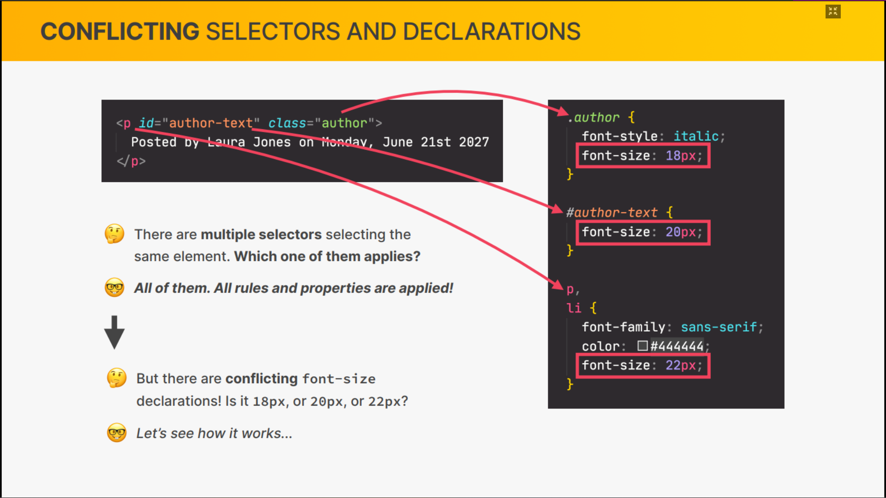
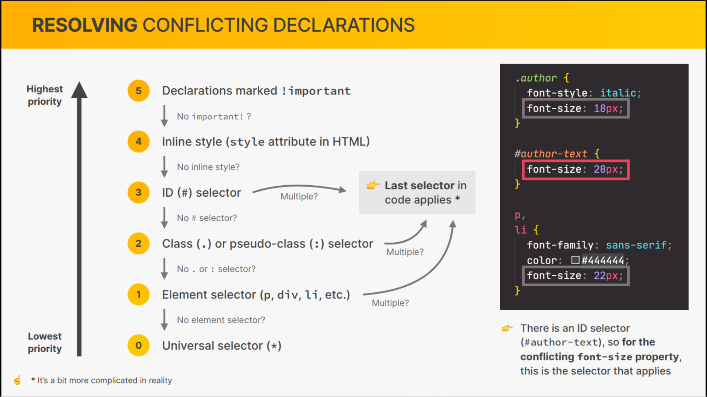

```css
#copyright {
  color: red;
}
.copyright {
  color: blue;
}
.text {
  color: yellow;
}

footer p {
  color: green;
}
```

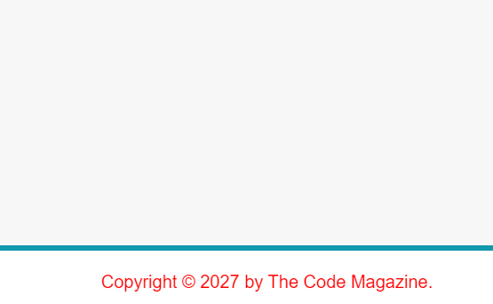

### CSS Theory #2\_ Inheritance

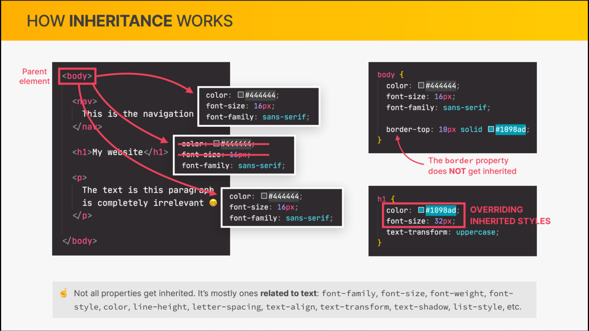
example:

```css
/* universal selector */
* {
  /* margin: 0;
  padding: 0; */
}
body {
  color: #444;
  font-family: sans-serif;
}
```

and the Universal Selector

### CHALLENGE #1

```html
<html lang="en">
  <head>
    <meta charset="UTF-8" />
    <meta http-equiv="X-UA-Compatible" content="IE=edge" />
    <meta name="viewport" content="width=device-width, initial-scale=1.0" />
    <title>Side Project</title>
  </head>
  <body>
    <article class="product">
      <header>
        <h1 class="product-title">Converse Chuck Taylor All Star Low Top</h1>
        
      </header>
      <p class="price"><strong>$ 65.00</strong></p>
      <p class="shipping">Freen Shipping</p>
      <p>
        Ready to dress up or down. these classic canvas chuks are an every day
        staple
      </p>
      <a class="more-info" href="#">More Information &rarr;</a>
      <h2 class="details-title">Product Details</h2>
      <ul class="details-list">
        <li>Lightweight, durable canvas sneaker</li>
        <li>Lightyt padded footbed for added comfort</li>
        <li>Iconic chuck taylor ankle patch</li>
      </ul>
      <button class="add-cart">Add to cart</button>
    </article>
  </body>
</html>
```

```css
body {
  font-family: sans-serif;
  line-height: 1.4;
}
/* PRODUCT */
.product {
  border: 5px solid black;
}

.product-title {
  text-align: center;
  text-transform: uppercase;
  font-size: 22px;
  font-color: #f7f7f7;
}
/* PRODUCT INFORMATION */
.price {
  font-size: 24px;
}
.shipping {
  color: #777;
  font-size: 12px;
  text-transform: uppercase;
  font-weight: bold;
}

a:link,
a:visited {
  color: #222;
}

.more-info:hover,
.more-info:active {
  text-decoration: none;
}
.more-info:active {
  color: #222;
}
/* PRODUCT DETAILS */
.details-title {
  text-transform: uppercase;
  font-size: 16px;
}
.details-list {
  list-style: square;
}
.add-cart {
  background: #000;
  color: white;
  text-transform: uppercase;
  font-size: 20px;
  border: none;
}

.add-cart:hover {
  background: white;
  color: black;
  cursor: pointer;
}
```

output

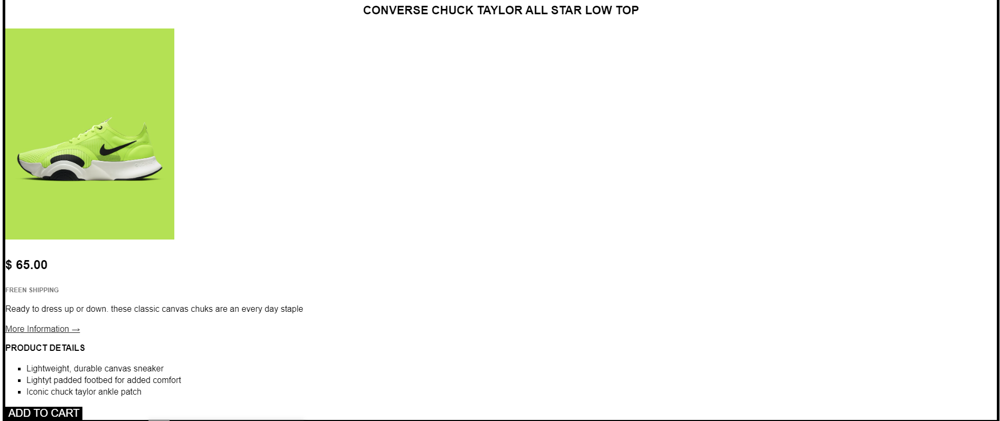

### CSS Theory #3\_ The CSS Box Model

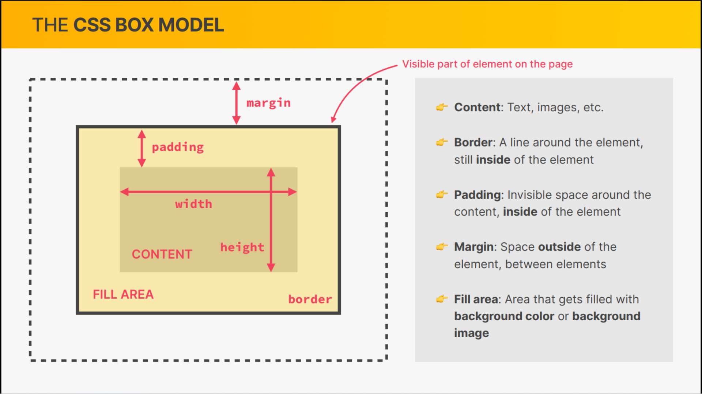
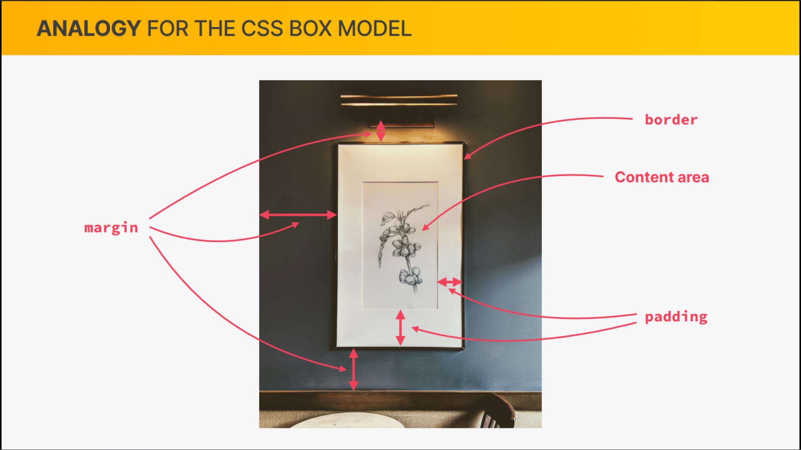
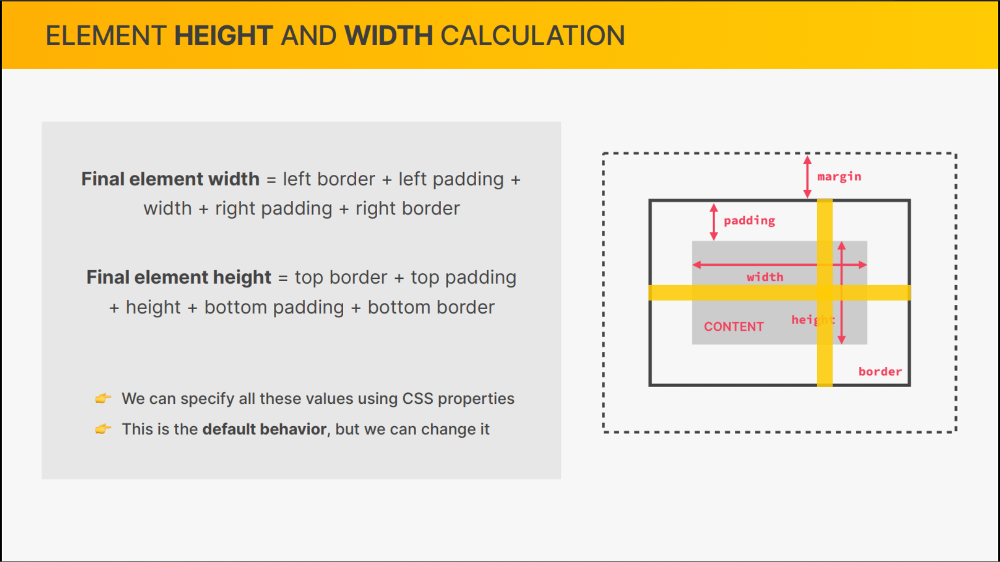

### Using Margins and Paddings

what is margin collapsing?
when there is margin applied to the adjacent elements, the margin collapses
bigger one gets applied.
to avoid these stick to one bottom or top
don't mix the margin

```css
/* universal selector */
* {
  margin: 0;
  padding: 0;
}
body {
  color: #444;
  font-family: sans-serif;
}
.main-header {
  background-color: #f7f7f7;
  padding: 20px 40px;
  margin-bottom: 60px;
}

.post-header {
  margin-bottom: 40px;
}
aside {
  background-color: #f7f7f7;
  border-top: 5px solid #1098ad;
  border-bottom: 5px solid #1098ad;
  padding: 50px 0;
}
article {
  margin-bottom: 60px;
}
nav {
  font-size: 18px;
}
h1,
h2,
h3 {
  color: #1098ad;
}

h1 {
  font-size: 26px;
  text-transform: uppercase;
  font-style: italic;
}

h2 {
  font-size: 40px;
  margin-bottom: 30px;
}

h3 {
  font-size: 30px;
  margin-bottom: 20px;
}

h4 {
  font-size: 20px;
  text-transform: uppercase;
  text-align: center;
}

p {
  font-size: 22px;
  line-height: 1.5;
  margin-bottom: 15px;
}

ul,
ol {
  margin-left: 50px;
  margin-bottom: 20px;
}

li {
  font-size: 20px;
  margin-bottom: 10px;
}
li:last-child {
  margin-bottom: 0;
}
/* nested selectors */
/* footer p {
  font-size: 16px;
} */

#copyright {
  font-size: 16px;
  text-align: center;
}

/* here we are encoding our html structure in to our css */
article header p {
  font-style: italic;
  font-size: 18px;
}
/* here is a solution to the above problem */
#author {
  font-style: italic;
  font-size: 18px;
}

.related-author {
  font-size: 18px;
  font-weight: bold;
}

.related {
  list-style: none;
}

/* misconception wont't work */
article p:first-child {
  color: red;
}

/* styling hyper links */

/* these order is important */
a:link {
  color: #1098ad;
  text-decoration: none;
}

a:visited {
  color: #1098ad;
  text-decoration: none;
}

a:hover {
  color: orangered;
  font-weight: bold;
  text-decoration: underline dotted orangered;
}

a:active {
  background-color: black;
  font-style: italic;
}
```

### Adding Dimensions

adding styles to the img tag

```css
.post-image {
  width: 100%;
  height: auto;
}
```

### Centering ourPage

let's wrap everything in a div

```html
<div class="container">
  <header class="main-header">
    <nav>...</nav>
  </header>

  <article>...</article>

  <aside>...</aside>

  <footer>...</footer>
</div>
```

```css
.container {
  width: 800px;
  margin: 0 auto;
}
```

output
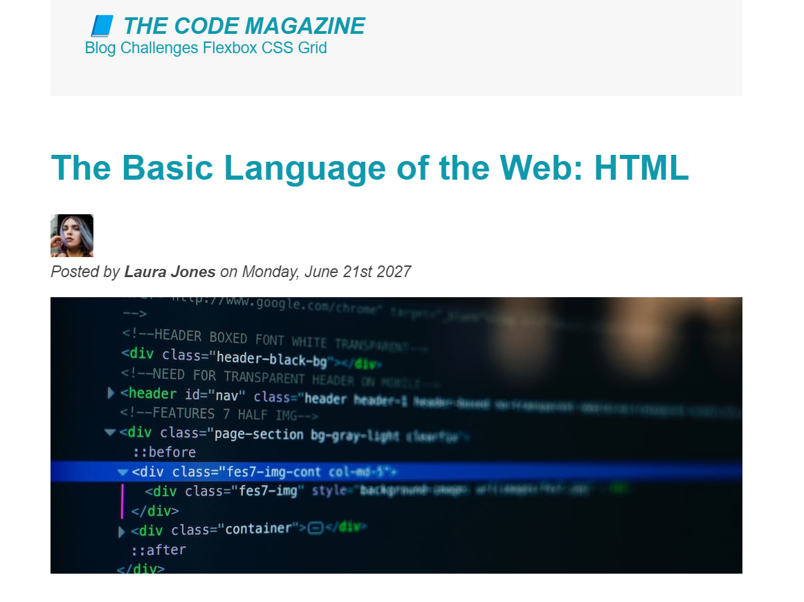

### CHALLENGE #2

```html
<html lang="en">
  <head>
    <meta charset="UTF-8" />
    <meta http-equiv="X-UA-Compatible" content="IE=edge" />
    <meta name="viewport" content="width=device-width, initial-scale=1.0" />
    <title>Side Project</title>
  </head>
  <body>
    <div class="container">
      <article class="product">
        <header>
          <h1 class="product-title">Converse Chuck Taylor All Star Low Top</h1>
          
        </header>
        <p class="price"><strong>$ 65.00</strong></p>
        <p class="shipping">Freen Shipping</p>
        <p class="description">
          Ready to dress up or down. these classic canvas chuks are an every day
          staple
        </p>
        <a class="more-info" href="#">More Information &rarr;</a>
        <h2 class="details-title">Product Details</h2>
        <ul class="details-list">
          <li>Lightweight, durable canvas sneaker</li>
          <li>Lightyt padded footbed for added comfort</li>
          <li>Iconic chuck taylor ankle patch</li>
        </ul>
        <button class="add-cart">Add to cart</button>
      </article>
    </div>
  </body>
</html>
```

```css
*{
  margin:0;
  padding:0;
}
body{
  font-family:sans-serif;
  line-height:1.4;
}
.container{
  width:800px;
  margin:50px auto;
}
/* PRODUCT */
.product{
  border:5px solid black;
}

.product-title{
  text-align:center;
  text-transform:uppercase;
  f ont-size:22px;
  font-color:#f7f7f7;
  padding:10px 0;
  background: #eee;
}
/* PRODUCT INFORMATION */
.price{
  font-size:24px;
}
.shipping{
  color:#777;
  font-size:12px;
  text-transform:uppercase;
  font-weight:bold;
  margin-bottom:20px;
}
.description{
  margin-bottom:20px;
}
a:link,a:visited{
  color:#222;
}
.more-info:hover,.more-info:active{
    text-decoration:none
}
.more-info:active{
   color:#222;
}
/* PRODUCT DETAILS */
.details-title{
  margin-top:20px;
  margin-bottom:10px;
  text-transform:uppercase;
  font-size:16px;
}
.details-list{
list-style:square;
padding-left:20px;
}
..details-list li{
  margin-bottom:10px;
}
.add-cart{
  background: #000;
  padding-top:10px;
  padding-bottom:10px;
  width:100%;
  color: white;
  text-transform:uppercase;
  font-size:20px;
  border:none;
}

.add-cart:hover{
   background: white;
  color: black;
  cursor:pointer;
  border-top:4px solid black;
}
```

output

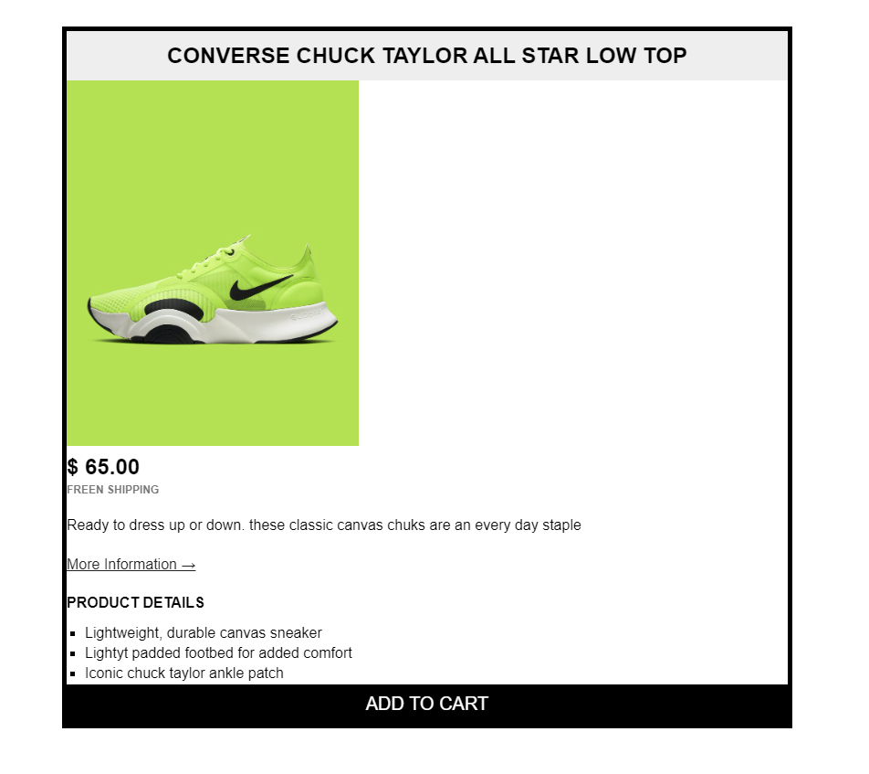

### CSS Theory #4\_ Types of Boxes

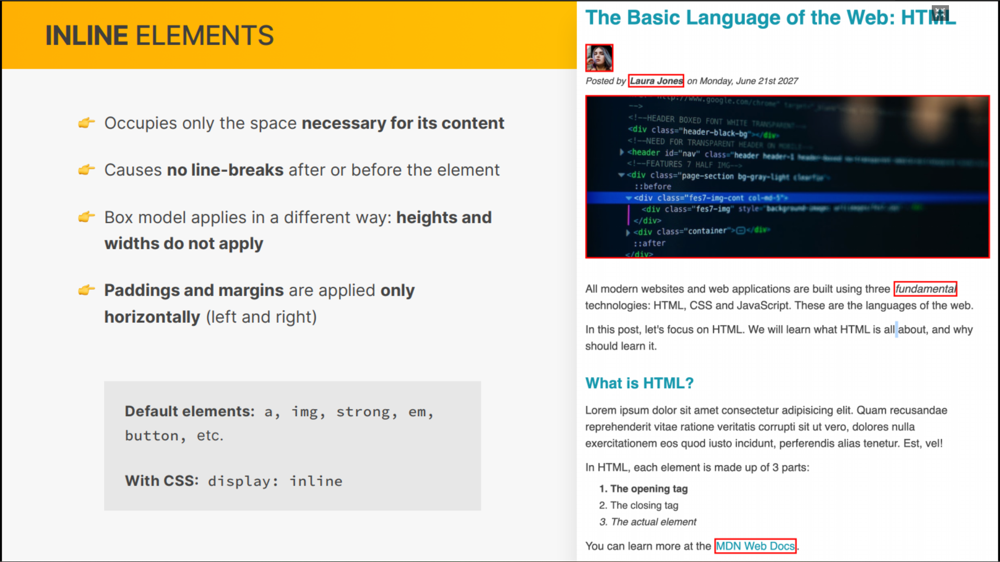
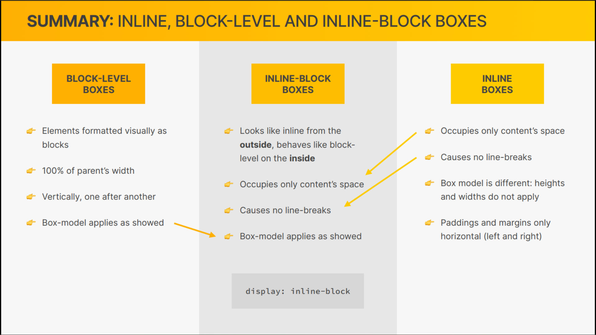

```css
nav a:link {
  /* background-color: orangered;
margin: 20px;
padding: 20px;
display: block; */
  margin-right: 20px;
  margin-top: 10px;
  display: inline-block;
}

nav a:link:last-child {
  margin-right: 0px;
}
```

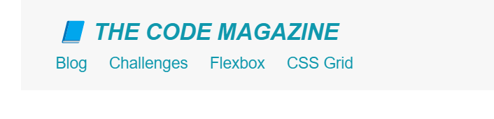

### CSS Theory #5_Absolute Positioning

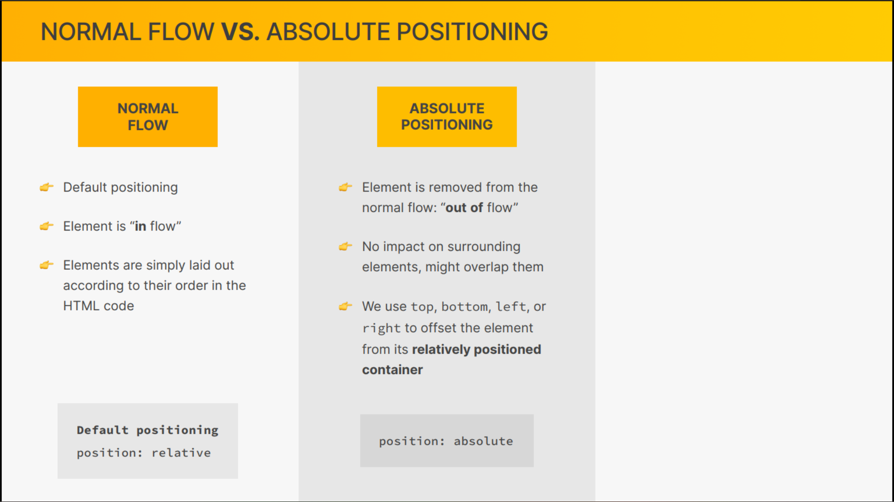
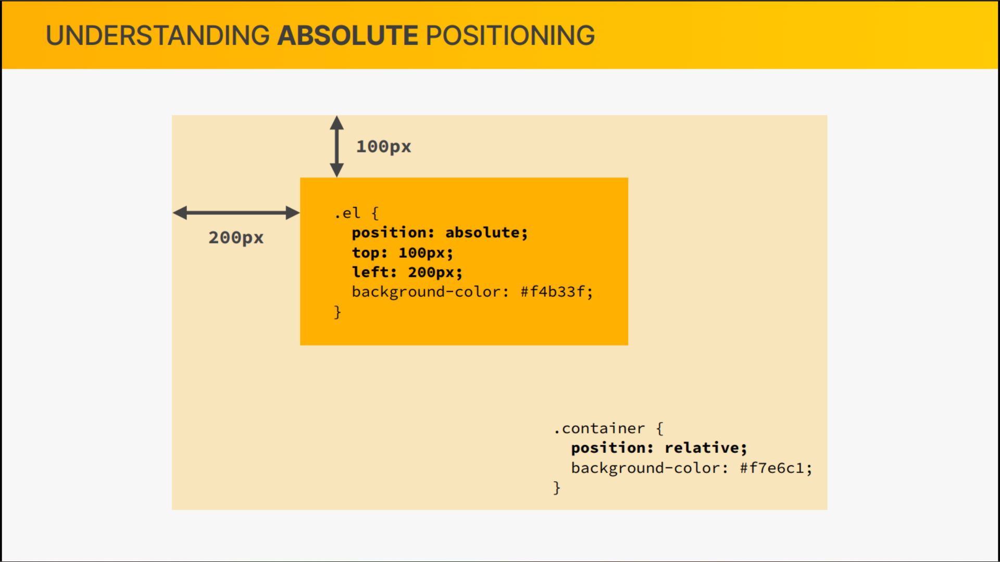

```css
body {
  color: #444;
  font-family: sans-serif;
  position: relative;
}

button {
  font-size: 22px;
  padding: 20px;
  cursor: pointer;
  position: absolute;
  bottom: 50px;
  right: 50px;
}
```

output

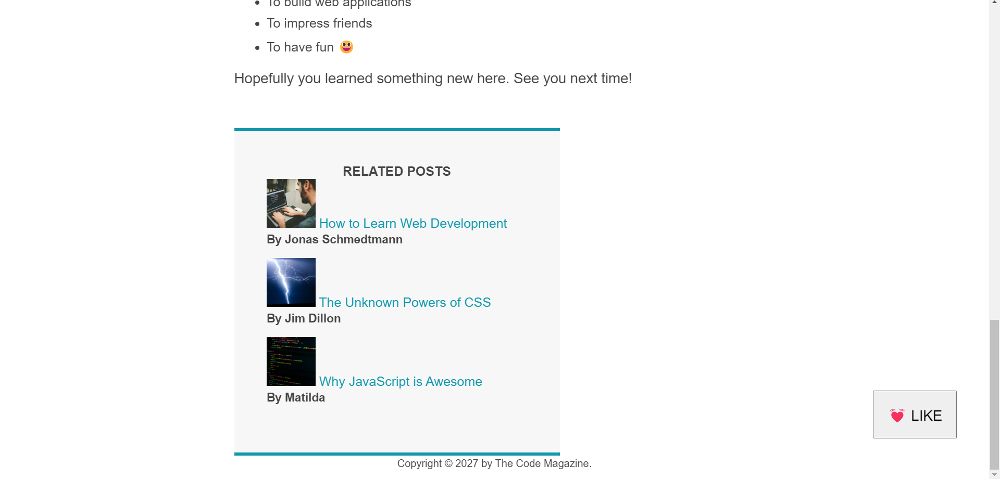

### Pseudo-elements

### Developer Skill #1\_ Googling and Reading Documentation

### Developer Skill #2\_ Debugging and Asking Questions

### CHALLENGE #3
