- [The 3 Ways of Building Layouts](#the-3-ways-of-building-layouts)
- [Using Floats](#using-floats)
- [Clearing Floats](#clearing-floats)
- [Building a Simple Float Layout](#building-a-simple-float-layout)
- [box-sizing\_ border-box](#box-sizing_-border-box)
- [CHALLENGE #1](#challenge-1)
- [Introduction to Flexbox](#introduction-to-flexbox)
- [A Flexbox Overview](#a-flexbox-overview)
- [Spacing and Aligning Flex Items](#spacing-and-aligning-flex-items)
- [The flex Property](#the-flex-property)
- [Adding Flexbox to Our Project](#adding-flexbox-to-our-project)
- [Building a Simple Flexbox Layout](#building-a-simple-flexbox-layout)
- [CHALLENGE #2](#challenge-2)
- [Introduction to CSS Grid](#introduction-to-css-grid)
- [A CSS Grid Overview](#a-css-grid-overview)
- [Sizing Grid Columns and Rows](#sizing-grid-columns-and-rows)
- [Placing and Spanning Grid Items](#placing-and-spanning-grid-items)
- [Aligning Grid Items and Tracks](#aligning-grid-items-and-tracks)
- [Building a Simple CSS Grid Layout](#building-a-simple-css-grid-layout)
- [CHALLENGE #3](#challenge-3)

### The 3 Ways of Building Layouts

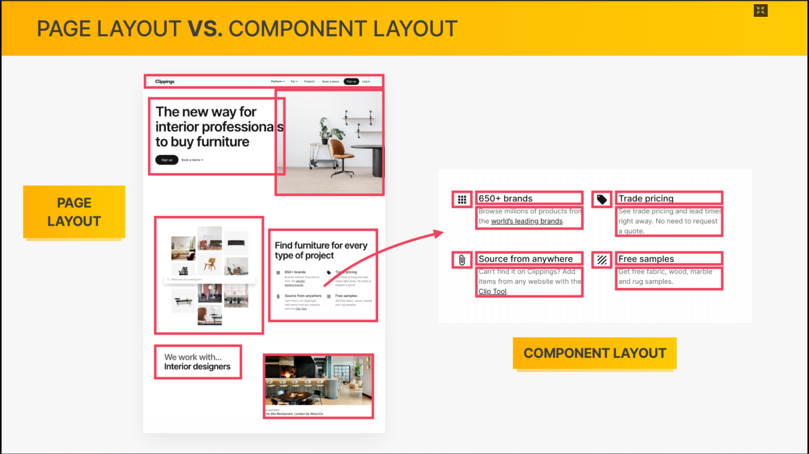
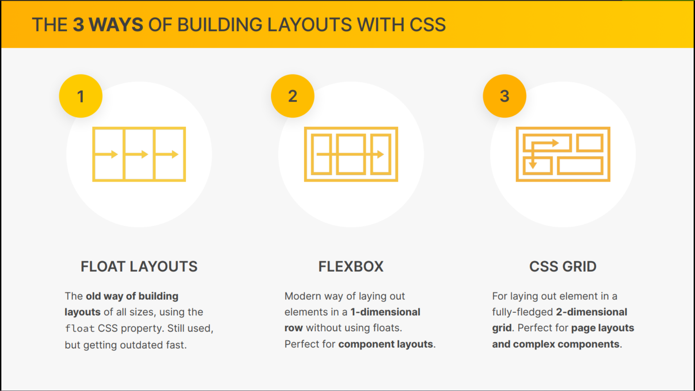

### Using Floats

let's give these elements class names

```html


<p id="author" class="author">
  Posted by <strong>Laura Jones</strong> on Monday, June 21st 2027. lore
</p>
```

styles

```css
.author-image {
  float: left;
  margin-bottom: 10px;
}
.author {
  float: left;
  margin-left: 20px;
  margin-top: 10px;
}

h1 {
  float: left;
}
nav {
  float: right;
}
```

output

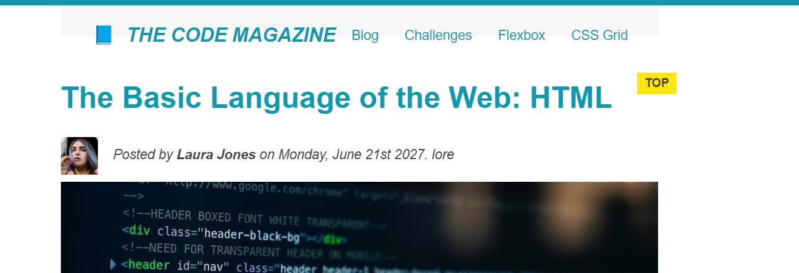

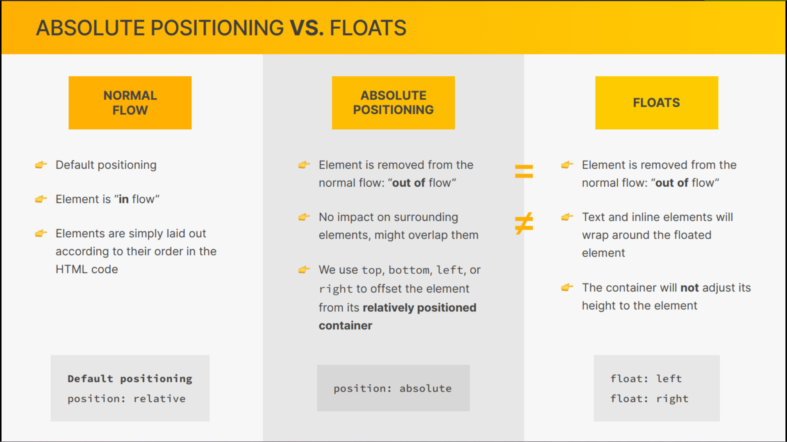

### Clearing Floats

```html
<div class="container">
  <header class="main-header clearfix">
    <h1>📘 The Code Magazine</h1>

    <nav>
      <!-- <strong>This is the navigation</strong> -->
      <a href="blog.html">Blog</a>
      <a href="#">Challenges</a>
      <a href="#">Flexbox</a>
      <a href="#">CSS Grid</a>
    </nav>
    <!-- <div class="clear"></div> -->
  </header>
</div>
```

```css
.clearfix::after {
  clear: both;
  content: '';
  display: block;
}
```

output

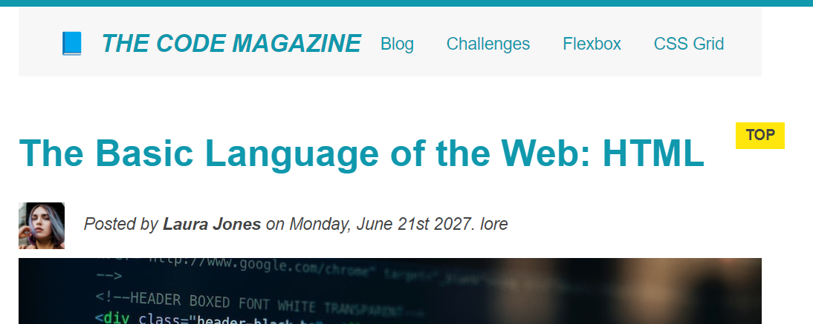

### Building a Simple Float Layout

let's change the width of the container

```css
.container {
  width: 1200px;
  /* margin-left: auto;
  margin-right: auto; */
  margin: 0 auto;
}

article {
  width: 825px;
  float: left;
}
aside {
  width: 300px;
  float: right;
}
footer {
  clear: both;
}
```

output

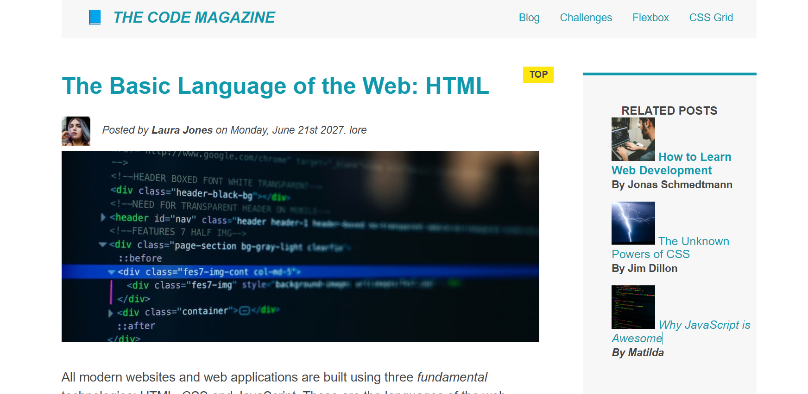

### box-sizing\_ border-box

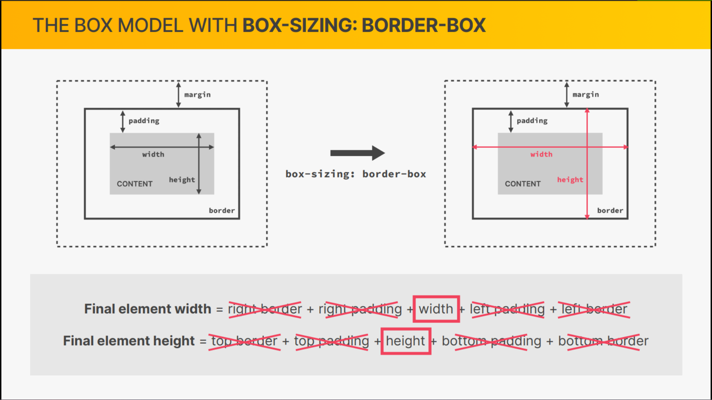
adding box-sizing to our styles

```css
* {
  box-sizing: border-box;
  margin: 0;
  padding: 0;
}

.related {
  list-style: none;
  margin-left: 0;
}

aside {
  width: 300px;
  float: right;
  padding: 50px 40px;
}
```

output

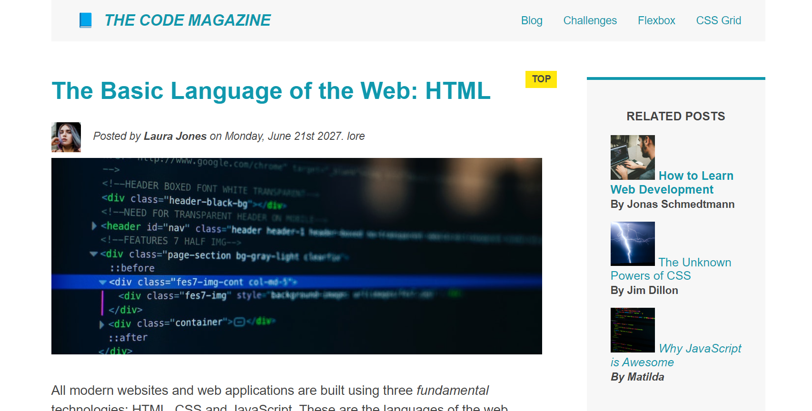

### CHALLENGE #1

html

```html
<!DOCTYPE html>
<html lang="en">
  <head>
    <meta charset="UTF-8" />
    <meta http-equiv="X-UA-Compatible" content="IE=edge" />
    <meta name="viewport" content="width=device-width, initial-scale=1.0" />
    <link rel="stylesheet" href="style.css" />
    <title>Side Project</title>
  </head>
  <body>
    <div class="container">
      <article class="product">
        <h1 class="product-title">Converse Chuck Taylor All Star Low Top</h1>

        <div class="card-body">
          
          <div class="card-details">
            <p class="price"><strong>$ 65.00</strong></p>
            <p class="shipping">Freen Shipping</p>
            <p class="description">
              Ready to dress up or down. these classic canvas chuks are an every
              day staple
            </p>
            <a class="more-info" href="#">More Information &rarr;</a>
            <div class="color-options">
              <span class="box"></span>
              <span class="box"></span>
              <span class="box"></span>
              <span class="box"></span>
              <span class="box"></span>
              <span class="box"></span>
            </div>
          </div>
        </div>
        <div class="card-footer">
          <h2 class="details-title">Product Details</h2>
          <ul class="details-list">
            <li>Lightweight, durable canvas sneaker</li>
            <li>Lightyt padded footbed for added comfort</li>
            <li>Iconic chuck taylor ankle patch</li>
          </ul>
        </div>
        <button class="add-cart">Add to cart</button>
      </article>
    </div>
  </body>
</html>
```

styles

```css
* {
  margin: 0;
  padding: 0;
  box-sizing: border-box;
}

body {
  font-family: sans-serif;
  line-height: 1.4;
}

.container {
  width: 1200px;
  margin: 50px auto;
  position: relative;
}

.container::before {
  content: 'SALE';
  background-color: red;
  color: #fff;
  font-weight: bold;
  position: absolute;
  top: -20px;
  left: -40px;
  padding: 10px 20px;
}

/* PRODUCT */
.product {
  border: 5px solid black;
}

.product-title {
  text-align: center;
  text-transform: uppercase;
  font-size: 22px;
  color: #222;
  padding: 10px 0;
  background: #eee;
}

/* PRODUCT INFORMATION */
.price {
  margin-top: 10px;
  font-size: 24px;
  float: left;
}

.shipping {
  margin-top: 10px;

  color: #777;
  font-size: 12px;
  text-transform: uppercase;
  font-weight: bold;
  margin-bottom: 20px;
  float: right;
}

.description {
  clear: both;
  margin-bottom: 20px;
}

a:link,
a:visited {
  color: #222;
}

.more-info:hover,
.more-info:active {
  text-decoration: none;
}

.more-info:active {
  color: #222;
}

/* PRODUCT DETAILS */
.details-title {
  margin-top: 20px;
  margin-bottom: 10px;
  text-transform: uppercase;
  font-size: 16px;
}

.details-list {
  list-style: square;
  padding-left: 20px;
}

.details-list li {
  margin-bottom: 10px;
}

.add-cart {
  background: #000;
  padding-top: 10px;
  padding-bottom: 10px;
  width: 100%;
  color: white;
  text-transform: uppercase;
  font-size: 20px;
  border: none;
}

.add-cart:hover {
  background: white;
  color: black;
  cursor: pointer;
  border-top: 4px solid black;
}

.color-options {
  margin-top: 20px;
  margin-bottom: 20px;
}

.box {
  display: inline-block;
  width: 20px;
  height: 20px;
  background-color: black;
  margin-right: 10px;
}

.box:nth-child(2) {
  background-color: blue;
}

.box:nth-child(3) {
  background-color: red;
}

.box:nth-child(4) {
  background-color: orange;
}

.box:nth-child(5) {
  background-color: green;
}

.box:nth-child(6) {
  background-color: brown;
  margin-right: 0;
}

.card-body {
  width: 800px;
  display: inline-block;
}
img {
  float: left;
}
.card-details {
  width: 350px;
  float: right;
}
.card-footer {
  float: right;
  width: 300px;
}
```

output

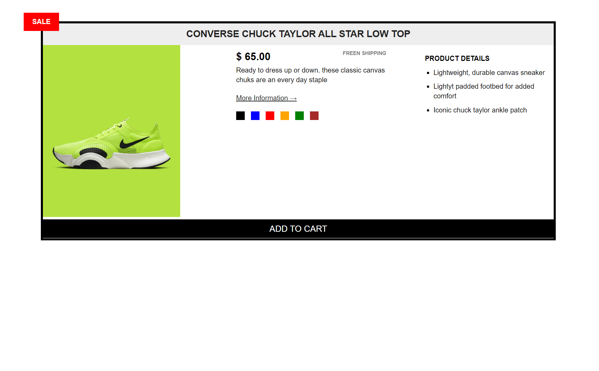

### Introduction to Flexbox

```html
<!DOCTYPE html>
<html lang="en">
  <head>
    <meta charset="UTF-8" />
    <meta http-equiv="X-UA-Compatible" content="IE=edge" />
    <meta name="viewport" content="width=device-width, initial-scale=1.0" />
    <title>Flexbox</title>
    <style>
      .el--1 {
        background-color: blueviolet;
      }
      .el--2 {
        background-color: orangered;
      }
      .el--3 {
        background-color: green;
        height: 150px;
      }
      .el--4 {
        background-color: goldenrod;
      }
      .el--5 {
        background-color: palevioletred;
      }
      .el--6 {
        background-color: steelblue;
      }
      .el--7 {
        background-color: yellow;
      }
      .el--8 {
        background-color: crimson;
      }

      .container {
        /* STARTER */
        font-family: sans-serif;
        background-color: #ddd;
        font-size: 34px;
        margin: 40px;

        /* FLEXBOX */
        display: flex;
        align-items: center;
        justify-content: space-evenly;
      }
    </style>
  </head>
  <body>
    <div class="container">
      <div class="el el--1">HTML</div>
      <div class="el el--2">and</div>
      <div class="el el--3">CSS</div>
      <div class="el el--4">are</div>
      <div class="el el--5">amazing</div>
      <div class="el el--6">languages</div>
      <div class="el el--7">to</div>
      <div class="el el--8">learn</div>
    </div>
  </body>
</html>
```

output

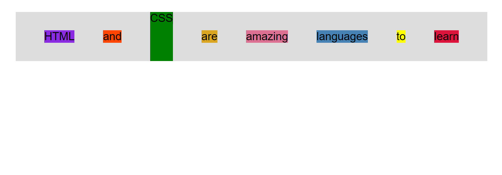

### A Flexbox Overview

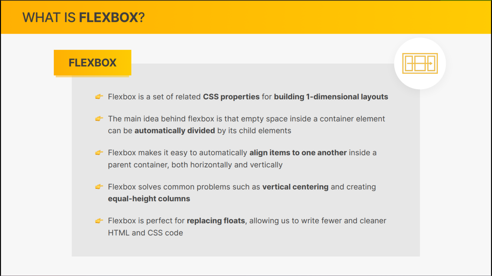
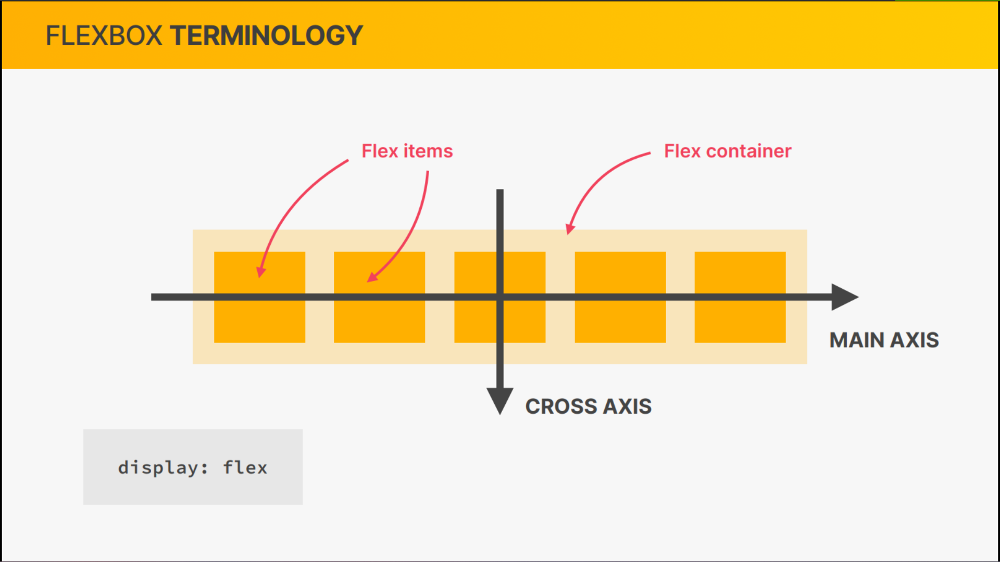
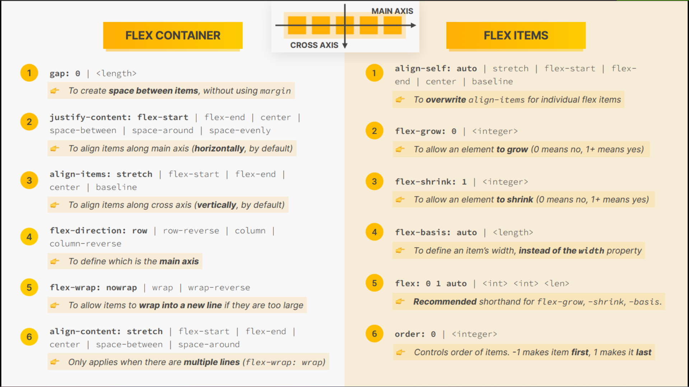

### Spacing and Aligning Flex Items

```css
.container {
  /* STARTER */
  font-family: sans-serif;
  background-color: #ddd;
  font-size: 34px;
  margin: 40px;

  /* FLEXBOX */
  display: flex;
  align-items: center;
  justify-content: flex-start;
  gap: 10px;
}

.el--1 {
  align-self: flex-start;
  /* order: 2; */
}
.el--4 {
  align-self: stretch;
  order: 1;
}
.el--6 {
  order: -1;
}
```

output

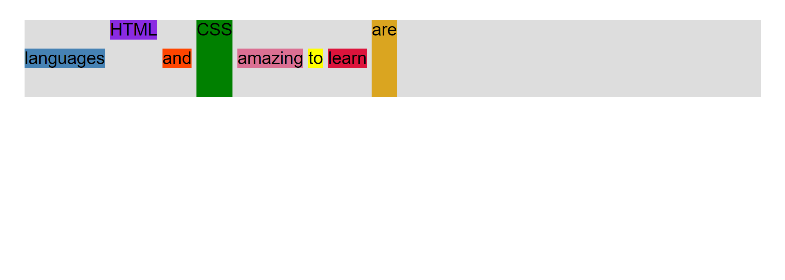

### The flex Property

```css
.el {
  /* DEFAULTS */
  /* flex-basis: auto;
        flex-grow: 0;
        flex-shrink: 1; */

  /* flex-basis: 500px; */
  /* flex-shrink: 0;
        flex-grow: 1; */
  flex: 1;
}

.el--1 {
  align-self: flex-start;
  /* order: 2; */
  flex-grow: 3;
}
```

output

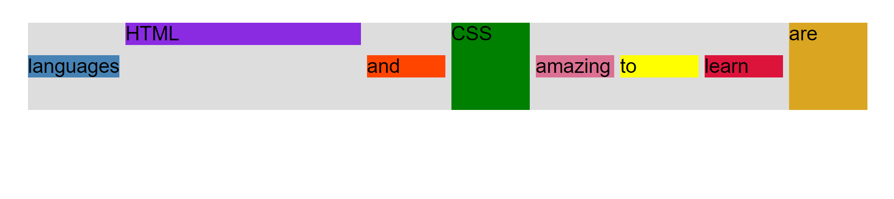

### Adding Flexbox to Our Project

```css
/* FLEX BOX */
.main-header {
  display: flex;
  justify-content: space-between;
  align-items: center;
}

.author-box {
  display: flex;
  align-items: center;
  gap: 10px;
  margin-bottom: 15px;
}
.author {
  margin-bottom: 0;
}
.related-box {
  display: flex;
  flex-direction: column;
  justify-content: center;
  align-items: flex-start;
}
.related li {
  display: flex;
  gap: 10px;
  margin-bottom: 20px;
}
.related-author {
  margin-bottom: 0;
  font-weight: normal;
  font-size: 14px;
  font-style: italic;
}

.related-box a:link {
  font-size: 17px;
  font-weight: bold;
  font-style: normal;
}
```

output

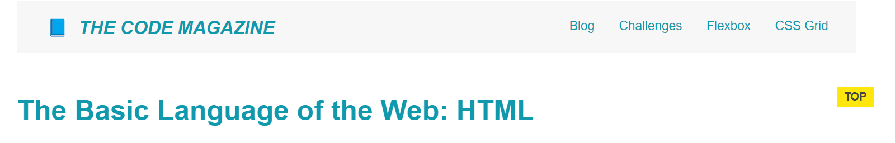
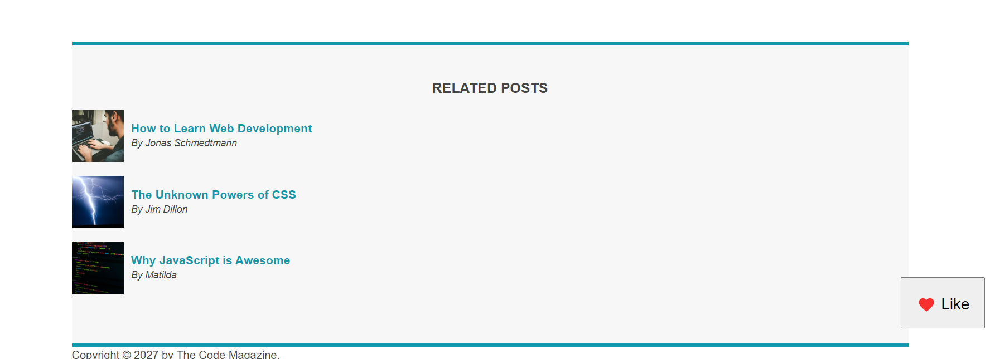

### Building a Simple Flexbox Layout

```html
<div class="row">article ... aside ....</div>
```

```css
.row {
  display: flex;
  gap: 75px;
  margin-bottom: 60px;
  align-items: flex-start;
}

article {
  flex: 1;
  margin-bottom: 0;
}
aside {
  flex: 0 0 300px;
}
```

output

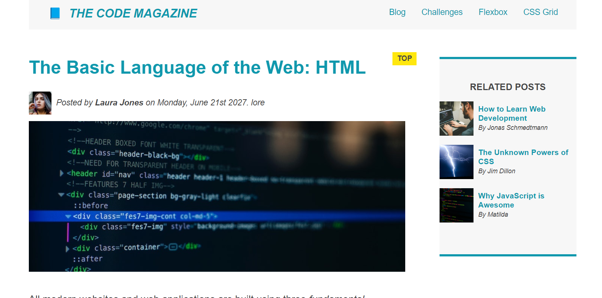

### CHALLENGE #2

```html
<!DOCTYPE html>
<html lang="en">
  <head>
    <meta charset="UTF-8" />
    <meta http-equiv="X-UA-Compatible" content="IE=edge" />
    <meta name="viewport" content="width=device-width, initial-scale=1.0" />
    <link rel="stylesheet" href="style.css" />
    <title>Document</title>
  </head>
  <body>
    <article class="product">
      <h2 class="product-title">Converse Chuck Taylor All Star Low Top</h2>
      <div class="container">
        
        <div class="product-info">
          <div class="price-box">
            <p class="price"><strong>$65.00</strong></p>
            <p class="shipping">Free shipping</p>
          </div>
          <p class="sale">Sale</p>

          <p class="product-description">
            Ready to dress up or down, these classic canvas Chucks are an
            everyday wardrobe staple.
          </p>
          <a href="https://converse.com" target="_blank" class="more-info"
            >More information &rarr;</a
          >

          <div class="colors">
            <div class="color"></div>
            <div class="color color-blue"></div>
            <div class="color color-red"></div>
            <div class="color color-yellow"></div>
            <div class="color color-green"></div>
            <div class="color color-brown"></div>
          </div>
        </div>

        <div class="product-details">
          <h3 class="details-title">Product details</h3>
          <ul class="details-list">
            <li>Lightweight, durable canvas sneaker</li>
            <li>Lightly padded footbed for added comfort</li>
            <li>Iconic Chuck Taylor ankle patch.</li>
          </ul>
        </div>
      </div>
      <button class="add-cart">Add to cart</button>
    </article>
  </body>
</html>
```

```css
.container {
  display: flex;
  align-items: center;
  /* justify-content: space-evenly; */
  gap: 60px;
  padding: 20px;
  /*   background-color: red; */
}
.product-img {
  margin-right: 0;
}
.product-info {
  margin-right: 0;
  margin-top: 0;
  align-self: flex-start;
}
.product-details {
  margin-top: 0;
  align-self: flex-start;
}

.price-box {
  display: flex;
  justify-content: space-between;
}
```

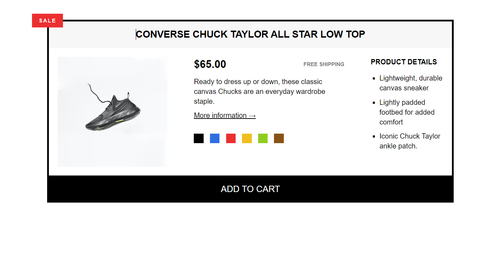

### Introduction to CSS Grid

```html
<!DOCTYPE html>
<html lang="en">
  <head>
    <meta charset="UTF-8" />
    <meta http-equiv="X-UA-Compatible" content="IE=edge" />
    <meta name="viewport" content="width=device-width, initial-scale=1.0" />
    <title>CSS Grid</title>
    <style>
      .el--1 {
        background-color: blueviolet;
      }
      .el--2 {
        background-color: orangered;
      }
      .el--3 {
        background-color: green;
        height: 150px;
      }
      .el--4 {
        background-color: goldenrod;
      }
      .el--5 {
        background-color: palevioletred;
      }
      .el--6 {
        background-color: steelblue;
      }
      .el--7 {
        background-color: yellow;
      }
      .el--8 {
        background-color: crimson;
      }

      .container--1 {
        /* STARTER */
        font-family: sans-serif;
        background-color: #ddd;
        font-size: 32px;
        margin: 40px;

        /* CSS GRID */
        display: grid;
        grid-template-columns: 250px 150px 200px 150px;
        grid-template-rows: 300px 100px;
        /* gap: 30px; */
        row-gap: 60px;
        column-gap: 30px;
      }

      .container--2 {
        /* STARTER */
        font-family: sans-serif;
        background-color: black;
        font-size: 40px;
        margin: 100px;

        width: 1000px;
        height: 600px;

        /* CSS GRID */
        display: none;
      }
    </style>
  </head>
  <body>
    <div class="container--1">
      <div class="el el--1">(1) HTML</div>
      <div class="el el--2">(2) and</div>
      <div class="el el--3">(3) CSS</div>
      <div class="el el--4">(4) are</div>
      <div class="el el--5">(5) amazing</div>
      <div class="el el--6">(6) languages</div>
      <div class="el el--7">(7) to</div>
      <div class="el el--8">(8) learn</div>
    </div>

    <div class="container--2">
      <div class="el el--1">(1)</div>
      <div class="el el--3">(3)</div>
      <div class="el el--4">(4)</div>
      <div class="el el--5">(5)</div>
      <div class="el el--6">(6)</div>
      <div class="el el--7">(7)</div>
    </div>
  </body>
</html>
```

output

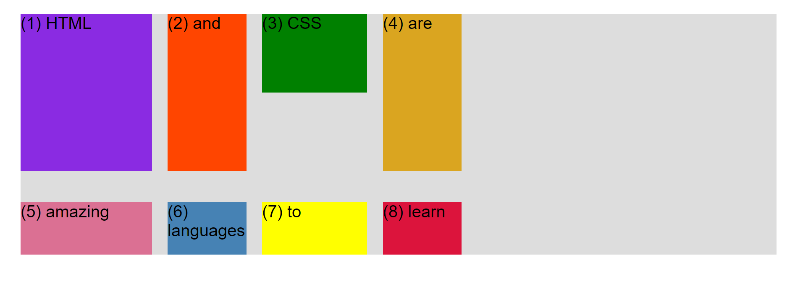

### A CSS Grid Overview

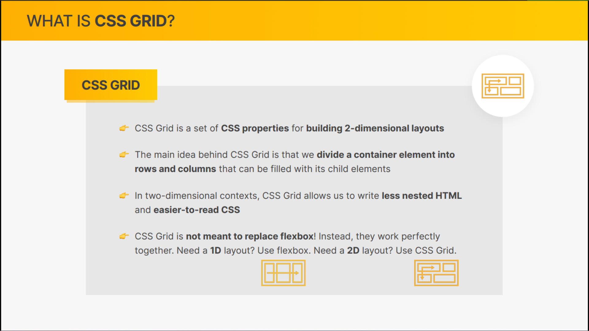
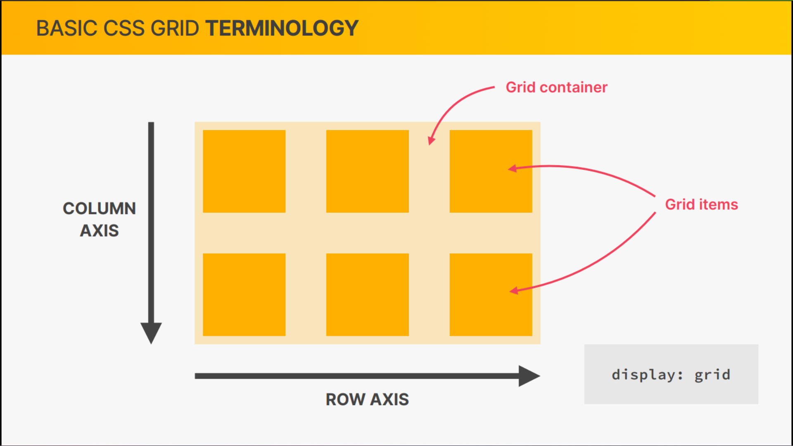
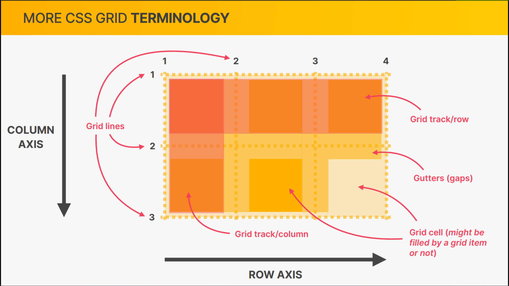
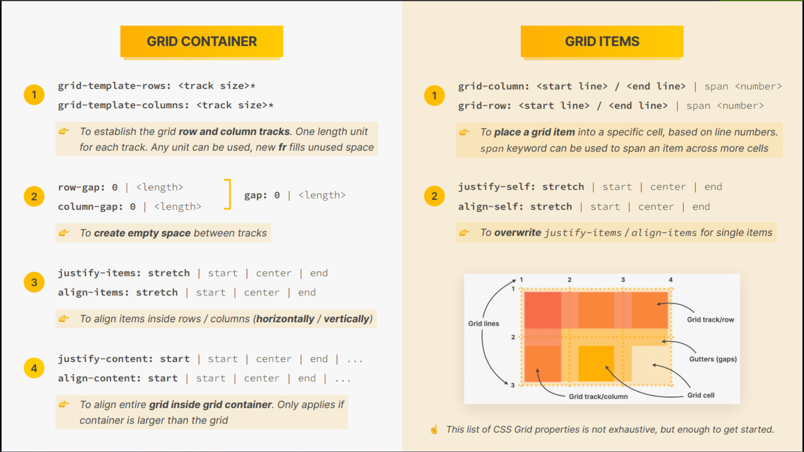

### Sizing Grid Columns and Rows

```css
.container--1 {
  /* STARTER */
  font-family: sans-serif;
  background-color: #ddd;
  font-size: 32px;
  margin: 40px;

  /* CSS GRID */
  display: grid;
  /* grid-template-columns: 1fr 1fr 1fr auto; */
  /* grid-template-rows: 300px 100px; */
  grid-template-columns: repeat(4, 1fr);
  grid-template-rows: 1fr auto;
  height: 500px;
  /* gap: 30px; */
  row-gap: 60px;
  column-gap: 30px;
}
```

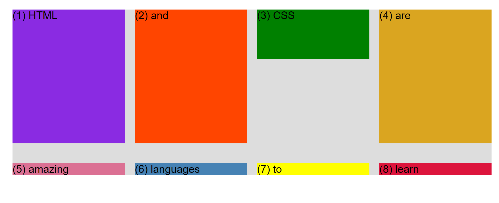

### Placing and Spanning Grid Items

### Aligning Grid Items and Tracks

### Building a Simple CSS Grid Layout

### CHALLENGE #3
