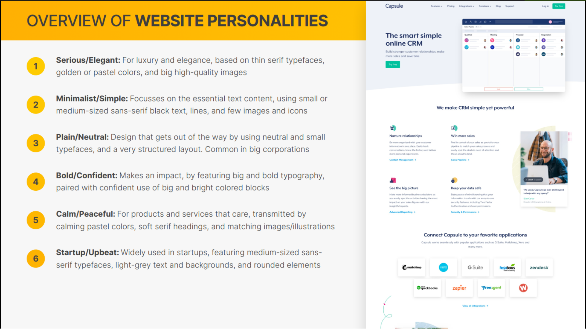
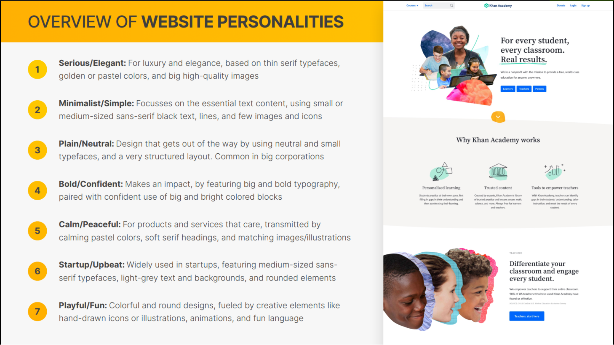
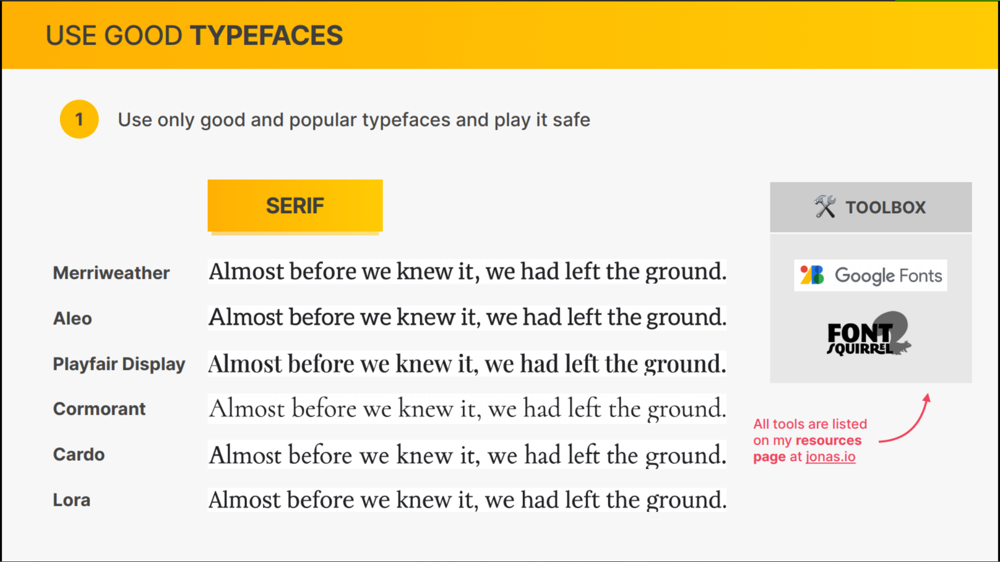
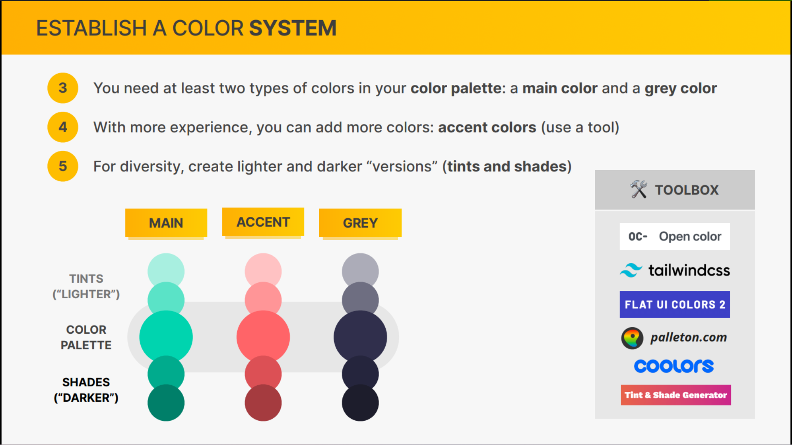
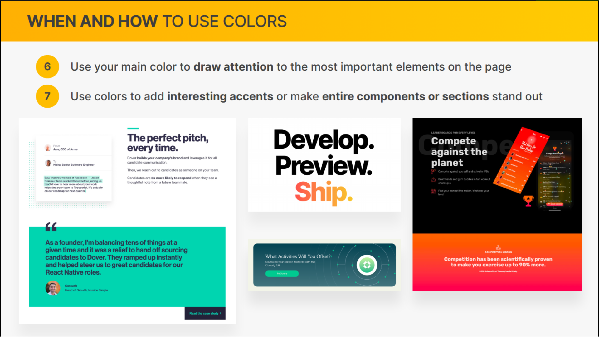
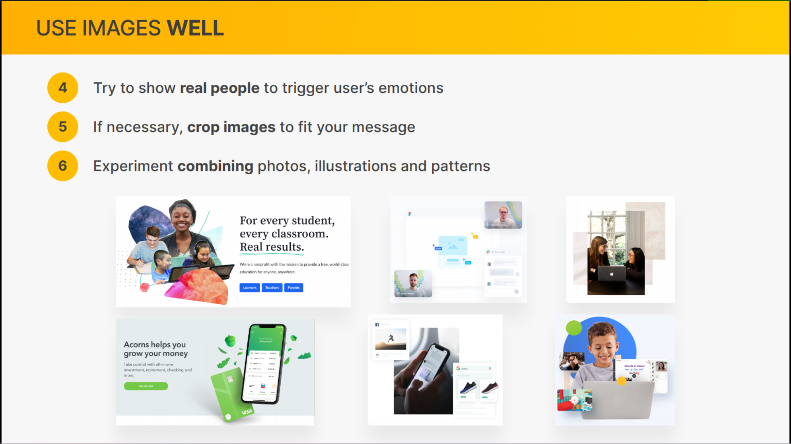

- [Overview of Web Design and Website Personalities](#overview-of-web-design-and-website-personalities)
- [Web Design Rules #1\_ Typography](#web-design-rules-1_-typography)
- [Implementing Typography](#implementing-typography)
- [Web Design Rules #2\_ Colors](#web-design-rules-2_-colors)
- [Implementing Colors](#implementing-colors)
- [Web Design Rules #3\_ Images and Illustrations](#web-design-rules-3_-images-and-illustrations)
- [Web Design Rules #4\_ Icons](#web-design-rules-4_-icons)
- [Implementing Icons](#implementing-icons)
- [Web Design Rules #5\_ Shadows](#web-design-rules-5_-shadows)
- [Implementing Shadows](#implementing-shadows)
- [Web Design Rules #6\_ Border-radius](#web-design-rules-6_-border-radius)
- [Implementing Border-radius](#implementing-border-radius)
- [Web Design Rules #7\_ Whitespace](#web-design-rules-7_-whitespace)
- [Web Design Rules #8\_ Visual Hierarchy](#web-design-rules-8_-visual-hierarchy)
- [Implementing Whitespace and Visual Hierarchy](#implementing-whitespace-and-visual-hierarchy)
- [Web Design Rules #9\_ User Experience (UX)](#web-design-rules-9_-user-experience-ux)
- [The Website-Personalities-Framework](#the-website-personalities-framework)
- [The Missing Piece\_ Steal Like An Artist!](#the-missing-piece_-steal-like-an-artist)

### Overview of Web Design and Website Personalities





### Web Design Rules #1\_ Typography





### Implementing Typography

**html**

```html
<!DOCTYPE html>
<html lang="en">
  <head>
    <meta charset="UTF-8" />
    <meta http-equiv="X-UA-Compatible" content="IE=edge" />
    <meta name="viewport" content="width=device-width, initial-scale=1.0" />

    <link rel="preconnect" href="https://fonts.googleapis.com" />
    <link rel="preconnect" href="https://fonts.gstatic.com" crossorigin />
    <link
      href="https://fonts.googleapis.com/css2?family=Inter:wght@400;500;700&display=swap"
      rel="stylesheet"
    />
    <link rel="stylesheet" href="style.css" />
    <title>Lisbon Chair Shop</title>
  </head>
  <body>
    <div class="container">
      <header>
        <div class="header-text-box">
          <h1>We design and build better chairs, for a better life</h1>
          <p class="header-text">
            In a small shop in the heart of Lisbon, we spend our days
            relentlessly perfecting the chair. The result is a perfect blend of
            beauty and comfort, that will have a lasting impact on your health.
          </p>
          <a class="btn btn--big" href="#">Shop chairs</a>
        </div>
        
      </header>

      <section>
        <h2>What makes our chairs special</h2>
        <div class="grid-3-cols">
          <div>
            <p class="features-title"><strong>Science meets design</strong></p>
            <p class="features-text">
              Lorem, ipsum dolor sit amet consectetur adipisicing elit. Natus
              similique adipisci praesentium.
            </p>
          </div>

          <div>
            <p class="features-title">
              <strong>Maximal comfort</strong>
            </p>
            <p class="features-text">
              Reprehenderit optio placeat quasi excepturi architecto, explicabo
              facilis perspiciatis error maxime magnam.
            </p>
          </div>

          <div>
            <p class="features-title">
              <strong>Ethical and sustainable</strong>
            </p>
            <p class="features-text">
              Deleniti recusandae quidem nesciunt, eos dolorum iure, quaerat
              omnis est laudantium voluptatem voluptas!
            </p>
          </div>
        </div>
      </section>

      <section class="testimonial-section">
        <div class="grid-3-cols">
          
          <div class="testimonial-box">
            <h2>"We couldn't live without these chairs anymore"</h2>
            <blockquote class="testimonial-text">
              Lorem ipsum dolor sit amet consectetur adipisicing elit. Dolor
              repellat at, nesciunt quia cum minima ipsum culpa totam sapiente
              recusandae earum debitis doloribus in quasi voluptatibus!
            </blockquote>
            <p class="testimonial-author">&mdash; Mary and Sarah Johnson</p>
          </div>
        </div>
      </section>

      <section>
        <h2>Our bestselling chairs</h2>
        <div class="grid-3-cols">
          <figure class="chair">
            
            <div class="chair-box">
              <h3>The Laid Back</h3>
              <ul class="chair-details">
                <li>
                  <!-- Span is a generic INLINE text element, it doesn't have any meaning. It's like a div element, but inline -->
                  <span>Leisure and relaxing</span>
                </li>
                <li>
                  <span>Comfortable for 4h</span>
                </li>
                <li>
                  <span>Vegan leather</span>
                </li>
                <li>
                  <span>Weighs 16 kg</span>
                </li>
              </ul>
              <div class="chair-price">
                <strong>250€</strong>
                <a href="#" class="btn btn--small">Add to cart</a>
              </div>
            </div>
          </figure>

          <figure class="chair">
            
            <div class="chair-box">
              <h3>The Worker Bee</h3>
              <ul class="chair-details">
                <li>
                  <span>Work</span>
                </li>
                <li>
                  <span>Comfortable for 8h</span>
                </li>
                <li>
                  <span>Vegan leather</span>
                </li>
                <li>
                  <span>Weighs 22 kg</span>
                </li>
              </ul>
              <div class="chair-price">
                <strong>525€</strong>
                <a href="#" class="btn btn--small">Add to cart</a>
              </div>
            </div>
          </figure>

          <figure class="chair">
            
            <div class="chair-box">
              <h3>The Chair 4/2</h3>
              <ul class="chair-details">
                <li>
                  <span>Leisure and relaxing</span>
                </li>
                <li>
                  <span>Comfortable all day!</span>
                </li>
                <li>
                  <span>Organic cotton</span>
                </li>
                <li>
                  <span>Weighs 80 kg</span>
                </li>
              </ul>
              <div class="chair-price">
                <strong>1450€</strong>
                <a href="#" class="btn btn--small">Add to cart</a>
              </div>
            </div>
          </figure>
        </div>
      </section>

      <footer>
        Copyright &copy; 2027 by Jonas Schmedtmann. Part of "Build Responsive
        Real-World Websites with HTML and CSS" online course. Use for learning
        purposes only.
      </footer>
    </div>
  </body>
</html>
```

**css**

```css
/*
SPACING SYSTEM (px)
2 / 4 / 8 / 12 / 16 / 24 / 32 / 48 / 64 / 80 / 96 / 128

FONT SIZE SYSTEM (px)
10 / 12 / 14 / 16 / 18 / 20 / 24 / 30 / 36 / 44 / 52 / 62 / 74 / 86 / 98
*/

* {
  margin: 0;
  padding: 0;
  box-sizing: border-box;
}

/* ------------------------ */
/* GENERAL STYLES */
/* ------------------------ */
body {
  font-family: 'Inter', sans-serif;
}

.container {
  width: 960px;
  margin: 0 auto;
}

header,
section {
  margin-bottom: 48px;
}

h2 {
  /*  24 / 30 / 36 */
  margin-bottom: 48px;
  font-size: 36px;
  letter-spacing: -0.5px;
}

.grid-3-cols {
  display: grid;
  grid-template-columns: repeat(3, 1fr);
  column-gap: 80px;
}

/* ------------------------ */
/* COMPONENT STYLES */
/* ------------------------ */

/* HEADER */
header {
  display: grid;
  grid-template-columns: repeat(2, 1fr);
  column-gap: 80px;
  margin-top: 48px;
}

.header-text-box {
  align-self: center;
}

h1 {
  margin-bottom: 24px;
  font-size: 44px;
  line-height: 1.1;
  letter-spacing: -1px;
  /* 44 52 62 */
}

.header-text {
  margin-bottom: 24px;
  font-size: 18px;
  line-height: 1.7;
  /* 16 / 18 / 20  */
}

img {
  width: 100%;
}

/* FEATURES */
.features-icon {
}

.features-title {
  margin-bottom: 16px;
  font-size: 20px;
}

.features-text {
  font-size: 18px;
  line-height: 1.7;
}

/* TESTIMONIAL */
.testimonial-section {
}

.testimonial-box {
  grid-column: 2 / -1;
  align-self: center;
}

.testimonial-box h2 {
  margin-bottom: 24px;
  /*  20 / 24 / 30 */
  font-size: 24px;
}

.testimonial-text {
  font-style: italic;
  margin-bottom: 24px;
  font-size: 18px;
  line-height: 1.7;
}

/* CHAIRS */
.chair-box {
  padding: 24px;
}

h3 {
  margin-bottom: 24px;
  font-size: 20px;
}

.chair-details {
  list-style: none;
  margin-bottom: 24px;
}

.chair-details li {
  display: flex;
  align-items: center;
  gap: 12px;
  margin-bottom: 24px;
}

.chair-details li:last-child {
  margin-bottom: 0;
}

.chair-icon {
}

.chair-price {
  display: flex;
  justify-content: space-between;
  font-size: 20px;
}

footer {
  margin-bottom: 48px;
  font-size: 14px;
}
```

**output**


### Web Design Rules #2\_ Colors








### Implementing Colors

```css
body {
  font-family: 'Inter', sans-serif;
  color: #343a40;
  border-bottom: 8px solid #099268;
}

.btn:link,
btn:visited {
  background-color: #087f5b;
  color: #fff;
  text-decoration: none;
  text-transform: uppercase;
  display: inline-block;
  font-weight: 500;
}

.btn:hover,
btn:active {
  background-color: #099268;
}

.btn--big {
  font-size: 18px;
  padding: 16px 32px;
}
.btn--small {
  font-size: 14px;
  padding: 8px 12px;
}

/* TESTIMONIAL */
.testimonial-section {
  background-color: #087f5b;
  padding: 24px;
  color: #fff;
}

footer {
  margin-bottom: 48px;
  font-size: 14px;
  color: #495057;
}
```

**output**


### Web Design Rules #3\_ Images and Illustrations





### Web Design Rules #4\_ Icons


### Implementing Icons

### Web Design Rules #5\_ Shadows

### Implementing Shadows

### Web Design Rules #6\_ Border-radius

### Implementing Border-radius

### Web Design Rules #7\_ Whitespace

### Web Design Rules #8\_ Visual Hierarchy

### Implementing Whitespace and Visual Hierarchy

### Web Design Rules #9\_ User Experience (UX)

### The Website-Personalities-Framework

### The Missing Piece\_ Steal Like An Artist!
