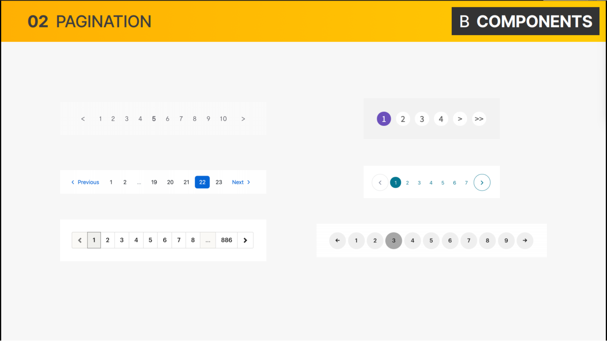
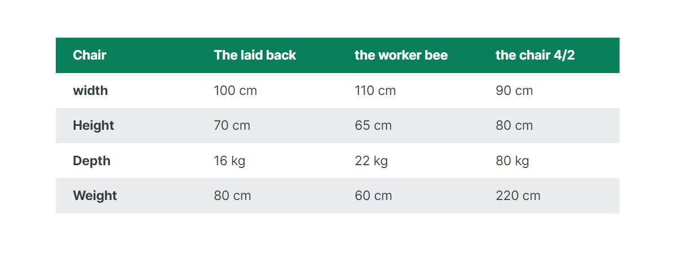
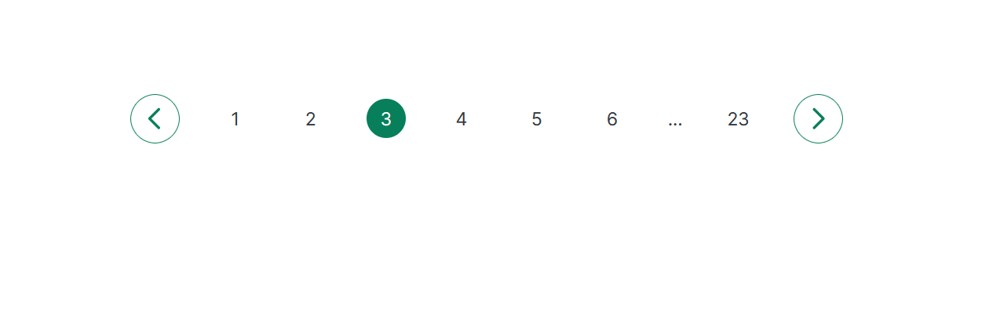
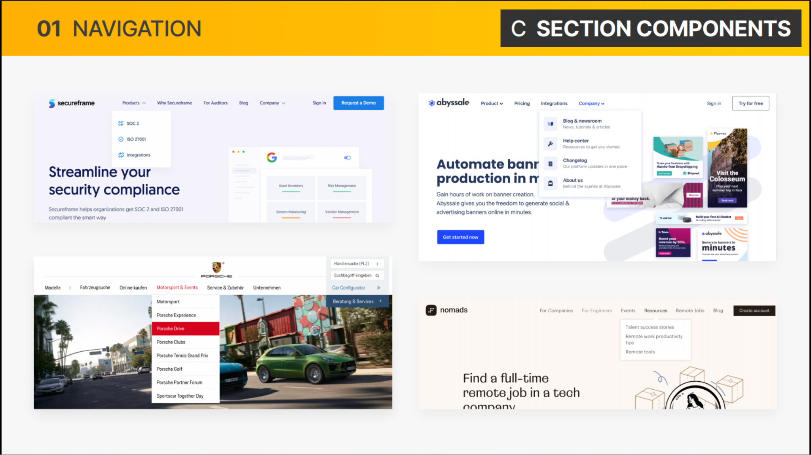
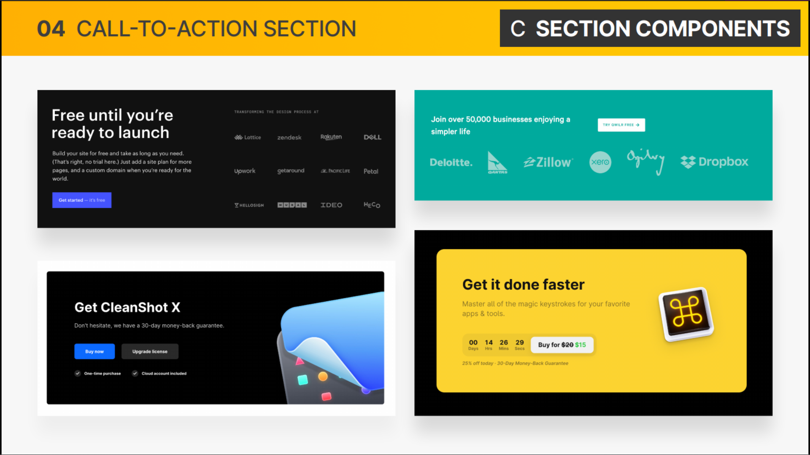

- [🥶 Web Design Rules #10 - Part 1\_ Elements and Components](#-web-design-rules-10---part-1_-elements-and-components)
- [👽 Building an Accordion Component - Part 1](#-building-an-accordion-component---part-1)
- [👿 Building an Accordion Component - Part 2](#-building-an-accordion-component---part-2)
- [🔥 Building a Carousel Component - Part 1](#-building-a-carousel-component---part-1)
- [🤡 Building a Carousel Component - Part 2](#-building-a-carousel-component---part-2)
- [🚀 Building a Table Component - Part 1](#-building-a-table-component---part-1)
- [🪨 Building a Table Component - Part 2](#-building-a-table-component---part-2)
- [🤖 CHALLENGE #1\_ Building a Pagination Component](#-challenge-1_-building-a-pagination-component)
- [🧑‍🎤 Web Design Rules #10 - Part 2\_ Layout Patterns](#-web-design-rules-10---part-2_-layout-patterns)
- [🧑‍🚀 Building a Hero Section - Part 1](#-building-a-hero-section---part-1)
- [🎈 Building a Hero Section - Part 2](#-building-a-hero-section---part-2)
- [🧨 Building a Web Application Layout - Part 1](#-building-a-web-application-layout---part-1)
- [🌵 Building a Web Application Layout - Part 2](#-building-a-web-application-layout---part-2)

### 🥶 Web Design Rules #10 - Part 1\_ Elements and Components





### 👽 Building an Accordion Component - Part 1

```html
<!DOCTYPE html>
<html lang="en">
  <head>
    <meta charset="UTF-8" />
    <meta http-equiv="X-UA-Compatible" content="IE=edge" />
    <meta name="viewport" content="width=device-width, initial-scale=1.0" />
    <link
      href="https://fonts.googleapis.com/css2?family=Inter:wght@400;500;700&display=swap"
      rel="stylesheet"
    />
    <style>
      /*
      SPACING SYSTEM (px)
      2 / 4 / 8 / 12 / 16 / 24 / 32 / 48 / 64 / 80 / 96 / 128

      FONT SIZE SYSTEM (px)
      10 / 12 / 14 / 16 / 18 / 20 / 24 / 30 / 36 / 44 / 52 / 62 / 74 / 86 / 98
      */

      /*
      MAIN COLOR : #087f5b
      GREY COLOR :#343a40

      */

      * {
        margin: 0;
        padding: 0;
        box-sizing: border-box;
      }

      /* ------------------------ */
      /* GENERAL STYLES */
      /* ------------------------ */
      body {
        font-family: "Inter", sans-serif;
        color: #343a40;
        line-height: 1;
      }

      .accordion {
        width: 700px;
        margin: 100px auto;
      }
      .item {
      }
      .number,
      .text {
        font-size: 24px;
        font-weight: 500;
        color: #099268;
      }
      .text {
      }
      .icon {
        height: 24px;
        width: 24px;
        stroke: #099268;
      }
      .hidden-box {
      }
      .hidden-box p {
        line-height: 1.6;
        margin-bottom: 24px;
      }

      .hidden-box ul {
        color: #868e96;
        margin-left: 14px;
        display: flex;
        flex-direction: column;
        gap: 12px;
      }
    </style>
    <title>Accordion Component</title>
  </head>
  <body>
    <div class="accordion">
      <div class="item">
        <p class="number">02</p>
        <p class="text">How long do i have to return my chair?</p>
        <svg
          xmlns="http://www.w3.org/2000/svg"
          class="icon"
          fill="none"
          viewBox="0 0 24 24"
          stroke="currentColor"
          stroke-width="2"
        >
          <path
            stroke-linecap="round"
            stroke-linejoin="round"
            d="M19 9l-7 7-7-7"
          />
        </svg>
        <div class="hidden-box">
          <p>
            Lorem ipsum dolor sit amet consectetur, adipisicing elit. Quae
            placeat incidunt voluptatibus quidem ipsa similique? Doloremque,
            nihil quibusdam. Fugiat ut nihil porro quo voluptas, ratione quae
            cum cumque molestiae distinctio.
          </p>
          <ul>
            <li>Lorem ipsum dolor sit amet consectetur,</li>
            <li>adipisicing elit. Velit sed voluptatibus,</li>
            <li>totam hic quaerat nihil et illo suscipit quia?</li>
            <li>Quia adipisci doloribus assumenda error impedit?</li>
            <li>Officia necessitatibus ea et doloribus.</li>
          </ul>
        </div>
      </div>
    </div>
  </body>
</html>
```

**output**


**theory**


### 👿 Building an Accordion Component - Part 2

```html
<!DOCTYPE html>
<html lang="en">
  <head>
    <meta charset="UTF-8" />
    <meta http-equiv="X-UA-Compatible" content="IE=edge" />
    <meta name="viewport" content="width=device-width, initial-scale=1.0" />
    <link
      href="https://fonts.googleapis.com/css2?family=Inter:wght@400;500;700&display=swap"
      rel="stylesheet"
    />
    <style>
      /*
      SPACING SYSTEM (px)
      2 / 4 / 8 / 12 / 16 / 24 / 32 / 48 / 64 / 80 / 96 / 128

      FONT SIZE SYSTEM (px)
      10 / 12 / 14 / 16 / 18 / 20 / 24 / 30 / 36 / 44 / 52 / 62 / 74 / 86 / 98
      */

      /*
      MAIN COLOR : #087f5b
      GREY COLOR :#343a40

      */

      * {
        margin: 0;
        padding: 0;
        box-sizing: border-box;
      }

      /* ------------------------ */
      /* GENERAL STYLES */
      /* ------------------------ */
      body {
        font-family: "Inter", sans-serif;
        color: #343a40;
        line-height: 1;
      }

      .accordion {
        width: 700px;
        margin: 100px auto;
        display: flex;
        flex-direction: column;
        gap: 24px;
      }
      .item {
        box-shadow: 0 0 32px rgba(0, 0, 0, 0.1);
        padding: 24px;
        display: grid;
        grid-template-columns: auto 1fr auto;
        column-gap: 24px;
        row-gap: 36px;
        align-items: center;
      }
      .number,
      .text {
        font-size: 24px;
        font-weight: 500;
        /* color: #099268; */
      }

      .number {
        color: #ced4da;
      }
      .text {
      }
      .icon {
        height: 24px;
        width: 24px;
        stroke: #099268;
      }
      .hidden-box {
        grid-column: 2;
        display: none;
      }
      .hidden-box p {
        line-height: 1.6;
        margin-bottom: 24px;
      }

      .hidden-box ul {
        color: #868e96;
        margin-left: 14px;
        display: flex;
        flex-direction: column;
        gap: 12px;
      }

      .open {
        border-top: 4px solid #099268;
      }

      .open .hidden-box {
        display: block;
      }

      .open .icon {
        transform: rotate(180deg);
      }

      .open .text,
      .open .number {
        color: #099268;
      }
    </style>
    <title>Accordion Component</title>
  </head>
  <body>
    <div class="accordion">
      <div class="item">
        <p class="number">01</p>
        <p class="text">Where are the chairs assembled ?</p>
        <svg
          xmlns="http://www.w3.org/2000/svg"
          class="icon"
          fill="none"
          viewBox="0 0 24 24"
          stroke="currentColor"
          stroke-width="2"
        >
          <path
            stroke-linecap="round"
            stroke-linejoin="round"
            d="M19 9l-7 7-7-7"
          />
        </svg>
        <div class="hidden-box">
          <p>
            Lorem ipsum dolor sit amet consectetur, adipisicing elit. Quae
            placeat incidunt voluptatibus quidem ipsa similique? Doloremque,
            nihil quibusdam. Fugiat ut nihil porro quo voluptas, ratione quae
          </p>
          <ul>
            <li>Lorem ipsum dolor sit amet consectetur,</li>
            <li>adipisicing elit. Velit sed voluptatibus,</li>
            <li>totam hic quaerat nihil et illo suscipit quia?</li>
            <li>Quia adipisci doloribus assumenda error impedit?</li>
            <li>Officia necessitatibus ea et doloribus.</li>
          </ul>
        </div>
      </div>
      <div class="item open">
        <p class="number">02</p>
        <p class="text">How long do i have to return my chair?</p>
        <svg
          xmlns="http://www.w3.org/2000/svg"
          class="icon"
          fill="none"
          viewBox="0 0 24 24"
          stroke="currentColor"
          stroke-width="2"
        >
          <path
            stroke-linecap="round"
            stroke-linejoin="round"
            d="M19 9l-7 7-7-7"
          />
        </svg>
        <div class="hidden-box">
          <p>
            Lorem ipsum dolor sit amet consectetur, adipisicing elit. Quae
            placeat incidunt voluptatibus quidem ipsa similique? Doloremque,
            nihil quibusdam. Fugiat ut nihil porro quo voluptas, ratione quae
          </p>
          <ul>
            <li>Lorem ipsum dolor sit amet consectetur,</li>
            <li>adipisicing elit. Velit sed voluptatibus,</li>
            <li>totam hic quaerat nihil et illo suscipit quia?</li>
            <li>Quia adipisci doloribus assumenda error impedit?</li>
            <li>Officia necessitatibus ea et doloribus.</li>
          </ul>
        </div>
      </div>
      <div class="item">
        <p class="number">03</p>
        <p class="text">Do you ship countries outside EU</p>
        <svg
          xmlns="http://www.w3.org/2000/svg"
          class="icon"
          fill="none"
          viewBox="0 0 24 24"
          stroke="currentColor"
          stroke-width="2"
        >
          <path
            stroke-linecap="round"
            stroke-linejoin="round"
            d="M19 9l-7 7-7-7"
          />
        </svg>
        <div class="hidden-box">
          <p>
            Lorem ipsum dolor sit amet consectetur, adipisicing elit. Quae
            placeat incidunt voluptatibus quidem ipsa similique? Doloremque,
            nihil quibusdam. Fugiat ut nihil porro quo voluptas, ratione quae
          </p>
          <ul>
            <li>Lorem ipsum dolor sit amet consectetur,</li>
            <li>adipisicing elit. Velit sed voluptatibus,</li>
            <li>totam hic quaerat nihil et illo suscipit quia?</li>
            <li>Quia adipisci doloribus assumenda error impedit?</li>
            <li>Officia necessitatibus ea et doloribus.</li>
          </ul>
        </div>
      </div>
    </div>
  </body>
</html>
```

**output**


### 🔥 Building a Carousel Component - Part 1

```html
<!DOCTYPE html>
<html lang="en">
  <head>
    <meta charset="UTF-8" />
    <meta http-equiv="X-UA-Compatible" content="IE=edge" />
    <meta name="viewport" content="width=device-width, initial-scale=1.0" />
    <link
      href="https://fonts.googleapis.com/css2?family=Inter:wght@400;500;700&display=swap"
      rel="stylesheet"
    />
    <style>
      /*
      SPACING SYSTEM (px)
      2 / 4 / 8 / 12 / 16 / 24 / 32 / 48 / 64 / 80 / 96 / 128

      FONT SIZE SYSTEM (px)
      10 / 12 / 14 / 16 / 18 / 20 / 24 / 30 / 36 / 44 / 52 / 62 / 74 / 86 / 98
      */
      /*
      MAIN COLOR : #087f5b
      GREY COLOR :#343a40

      */

      * {
        margin: 0;
        padding: 0;
        box-sizing: border-box;
      }

      /* ------------------------ */
      /* GENERAL STYLES */
      /* ------------------------ */
      body {
        font-family: "Inter", sans-serif;
        color: #343a40;
        line-height: 1;
      }

      .carousel {
        background-color: #087f5b;
        width: 800px;
        margin: 100px auto;
        border-radius: 8px;
        padding: 32px;
        padding-left: 86px;
        display: flex;
        align-items: center;
        gap: 86px;
      }

      img {
        border-radius: 8px;
        height: 200px;
        transform: scale(1.5);
        box-shadow: 0 12px 32px rgba(0, 0, 0, 0.25);
      }
      .testimonial-text {
        font-size: 18px;
        font-weight: 500;
        line-height: 1.5;
        margin-bottom: 32px;
        color: #e6fcf5;
      }
      .testimonial-author {
        font-size: 14px;
        margin-bottom: 4px;
        color: #c3fae8;
      }
      .testimonial-job {
        font-size: 12px;
        color: #c3fae8;
      }
      .button {
      }
      .button-icon {
      }
    </style>
    <title>Accordion Component</title>
  </head>
  <body>
    <div class="carousel">
      
      <blockquote class="testimonial">
        <p class="testimonial-text">
          "Lorem ipsum, dolor sit amet consectetur adipisicing elit. Nam nulla
          quia quod cumque unde, et ad minus debitis laborum, distinctio
          necessitatibus ratione eaque expedita. Debitis ullam delectus alias
          temporibus laboriosam!"
        </p>
        <p class="testimonial-author">maria de mel</p>
        <p class="testimonial-job">senior product manager at EDP commercial</p>
      </blockquote>
      <button class="button">
        <svg
          xmlns="http://www.w3.org/2000/svg"
          class="button-icon"
          fill="none"
          viewBox="0 0 24 24"
          stroke="currentColor"
          stroke-width="2"
        >
          <path
            stroke-linecap="round"
            stroke-linejoin="round"
            d="M15 19l-7-7 7-7"
          />
        </svg>
      </button>
      <button class="button">
        <svg
          xmlns="http://www.w3.org/2000/svg"
          class="button-icon"
          fill="none"
          viewBox="0 0 24 24"
          stroke="currentColor"
          stroke-width="2"
        >
          <path
            stroke-linecap="round"
            stroke-linejoin="round"
            d="M9 5l7 7-7 7"
          />
        </svg>
      </button>
    </div>
  </body>
</html>
```

output


### 🤡 Building a Carousel Component - Part 2

### 🚀 Building a Table Component - Part 1

### 🪨 Building a Table Component - Part 2

### 🤖 CHALLENGE #1\_ Building a Pagination Component

### 🧑‍🎤 Web Design Rules #10 - Part 2\_ Layout Patterns

### 🧑‍🚀 Building a Hero Section - Part 1

### 🎈 Building a Hero Section - Part 2

### 🧨 Building a Web Application Layout - Part 1

### 🌵 Building a Web Application Layout - Part 2












