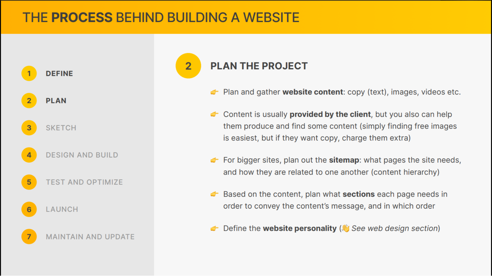

# Food Restaurant Part 1 🏠

- [Food Restaurant Part 1 🏠](#food-restaurant-part-1-)
  - [The 7 Steps to a Great Website](#the-7-steps-to-a-great-website)
    - [Defining and Planning the Project (Steps 1 and 2)](#defining-and-planning-the-project-steps-1-and-2)
      - [sections](#sections)
    - [Sketching Initial Layout Ideas (Step 3)](#sketching-initial-layout-ideas-step-3)
    - [First Design and Development Steps (Step 4)](#first-design-and-development-steps-step-4)
    - [Responsive Design Principles](#responsive-design-principles)
    - [How rem and max-width Work](#how-rem-and-max-width-work)
      - [**output**](#output)
    - [Building the Hero - Part 1](#building-the-hero---part-1)
      - [html](#html)
    - [Building the Hero - Part 2/3](#building-the-hero---part-23)
    - [Building the Header](#building-the-header)
    - [Building the Navigation](#building-the-navigation)
      - [Markup Update](#markup-update)
      - [adding style comments](#adding-style-comments)
      - [Navigation](#navigation)
      - [output](#output-1)
    - [Setting Up a Reusable Grid](#setting-up-a-reusable-grid)
      - [Markup Update](#markup-update-1)
      - [adding style to HOW IT WORKS SECTION](#adding-style-to-how-it-works-section)
      - [adding style to GENERAL REUSABLE COMPONENTS](#adding-style-to-general-reusable-components)
    - [Building the How-It-Works Section - Part 1](#building-the-how-it-works-section---part-1)
      - [Markup Update How-It-Works Section](#markup-update-how-it-works-section)
      - [adding style to HOW IT WORKS SECTION](#adding-style-to-how-it-works-section-1)
      - [output](#output-2)
    - [Building the How-It-Works Section - Part 2](#building-the-how-it-works-section---part-2)
      - [in this section we will add](#in-this-section-we-will-add)
      - [heading-tertiary class](#heading-tertiary-class)
      - [adding style to paragraph](#adding-style-to-paragraph)
      - [output so far](#output-so-far)
      - [let's style the image](#lets-style-the-image)
    - [output so far](#output-so-far-1)
      - [final output](#final-output)
    - [Building the Featured-In Section](#building-the-featured-in-section)
      - [adding html section](#adding-html-section)
      - [adding css section](#adding-css-section)
      - [output](#output-3)
    - [Building the Meals Section - Part 1](#building-the-meals-section---part-1)
      - [Adding html](#adding-html)
      - [Adding styles](#adding-styles)
      - [Output](#output-4)
    - [Building the Meals Section - Part 2](#building-the-meals-section---part-2)
      - [Adding HTML](#adding-html-1)
      - [Adding styles](#adding-styles-1)
      - [Output](#output-5)
    - [Building the Meals Section - Part 3](#building-the-meals-section---part-3)
      - [Adding Diet section](#adding-diet-section)
      - [Adding styles](#adding-styles-2)
      - [Output](#output-6)
    - [Building the Testimonials Section - Part 1](#building-the-testimonials-section---part-1)
    - [Building the Testimonials Section - Part 2](#building-the-testimonials-section---part-2)
    - [Building the Pricing Section - Part 1](#building-the-pricing-section---part-1)
    - [Building the Pricing Section - Part 2](#building-the-pricing-section---part-2)
    - [Building the Features Part](#building-the-features-part)
    - [Building the Call-To-Action Section - Part 1](#building-the-call-to-action-section---part-1)
    - [Building the Call-To-Action Section - Part 2](#building-the-call-to-action-section---part-2)
    - [Building the Call-To-Action Section - Part 3](#building-the-call-to-action-section---part-3)
    - [Building the Footer - Part 1](#building-the-footer---part-1)
    - [Building the Footer - Part 2](#building-the-footer---part-2)

## The 7 Steps to a Great Website





### Defining and Planning the Project (Steps 1 and 2)


#### sections

- Logo + Navigation
- Hero
- Featured in
- How it works
- Meals(list of diets)
- Testimonials + Gallery
- Pricing + Features
- CTA
- Footer

### Sketching Initial Layout Ideas (Step 3)


### First Design and Development Steps (Step 4)

```css
/* 
-- 01 TYPOGRAPHY SYSTEM
-- ---------------------------------------------------------
- FONT SIZE SYSTEM (px)
10 / 12 / 14 / 16 / 18 / 20 / 24 / 30 / 36 / 44 / 52 / 62 / 74 / 86 / 98

- FONT WEIGHT SYSTEM
Default: 400

- LINE HEIGHT SYSTEM (px)
Default:1


-- 02 COLORS SYSTEM

- PRIMARY COLOR : #e67e22
- TINTS:
- SHADES:
- ACCENTS:
- GRAYS:
#555

--- 05 SHADOWS 
--- 06 BORDER RADIUS
--- 07 WHITE SPACE
- SPACING SYSTEM (px)
2 / 4 / 8 / 12 / 16 / 24 / 32 / 48 / 64 / 80 / 96 / 128


      
*/

/* global reset */
* {
  margin: 0;
  padding: 0;
  box-sizing: border-box;
}

body {
  font-family: sans-serif;
  line-height: 1;
  font-weight: 400;
  color: #555;
}
```

```html
<!DOCTYPE html>
<html lang="en">
  <head>
    <meta charset="UTF-8" />
    <meta http-equiv="X-UA-Compatible" content="IE=edge" />
    <meta name="viewport" content="width=device-width, initial-scale=1.0" />
    <link rel="stylesheet" href="./css/style.css" />
    <title>Omini Food</title>
  </head>
  <body>
    <h1>A healthy meal delivered to your door, every single day</h1>
  </body>
</html>
```

**output**


### Responsive Design Principles


### How rem and max-width Work

```css
/* 
-- 01 TYPOGRAPHY SYSTEM
-- ---------------------------------------------------------
- FONT SIZE SYSTEM (px)
10 / 12 / 14 / 16 / 18 / 20 / 24 / 30 / 36 / 44 / 52 / 62 / 74 / 86 / 98

- FONT WEIGHT SYSTEM
Default: 400

- LINE HEIGHT SYSTEM (px)
Default:1


-- 02 COLORS SYSTEM

- PRIMARY COLOR : #e67e22
- TINTS:
- SHADES:
- ACCENTS:
- GRAYS:
#555

--- 05 SHADOWS 
--- 06 BORDER RADIUS
--- 07 WHITE SPACE
- SPACING SYSTEM (px)
2 / 4 / 8 / 12 / 16 / 24 / 32 / 48 / 64 / 80 / 96 / 128


      
*/

/* global reset */
* {
  margin: 0;
  padding: 0;
  box-sizing: border-box;
}

html {
  /* font-size: 10px; */
  /* 
  10/16*100 = 62.5%
  */
  font-size: 62.5%;
}

body {
  font-family: sans-serif;
  line-height: 1;
  font-weight: 400;
  color: #555;
}

.test {
  max-width: 50rem;
  background-color: red;
  padding: 4rem;
  font-size: 2rem;
  /* width: 1000px; */
}
```

#### **output**


### Building the Hero - Part 1

```css
/* 
-- 01 TYPOGRAPHY SYSTEM
-- ---------------------------------------------------------
- FONT SIZE SYSTEM (px)
10 / 12 / 14 / 16 / 18 / 20 / 24 / 30 / 36 / 44 / 52 / 62 / 74 / 86 / 98

- FONT WEIGHT SYSTEM
Default: 400

- LINE HEIGHT SYSTEM (px)
Default:1


-- 02 COLORS SYSTEM

- PRIMARY COLOR : #e67e22
- TINTS:
- SHADES:
- ACCENTS:
- GRAYS:
#555

--- 05 SHADOWS 
--- 06 BORDER RADIUS
--- 07 WHITE SPACE
- SPACING SYSTEM (px)
2 / 4 / 8 / 12 / 16 / 24 / 32 / 48 / 64 / 80 / 96 / 128


      
*/

/* global reset */
* {
  margin: 0;
  padding: 0;
  box-sizing: border-box;
}

html {
  /* font-size: 10px; */
  /* 
  10/16*100 = 62.5%
  */
  font-size: 62.5%;
}

body {
  font-family: sans-serif;
  line-height: 1;
  font-weight: 400;
  color: #555;
}
.hero {
  max-width: 130rem;
  margin: 0 auto;
  display: grid;
  grid-template-columns: 1fr 1fr;
}
.hero-img {
  width: 100%;
}
```

#### html

```html
<section class="section-hero">
  <div class="hero">
    <div class="hero-text-box">
      <h1 class="heading-primary">
        A healthy meal delivered to your door, every single day
      </h1>
      <div class="hero-description">
        The smart 365-days-per-year food subscription that will make you eat
        healthy again. Tailored to your personal tastes and nutritional needs.
        We have delivered 250,000+ meals last year!
      </div>
      <a class="btn " href="#">start eating well</a>
      <a class="btn " href="#">Learn more &darr;</a>
    </div>
    <div class="hero-img-box">
      
    </div>
  </div>
</section>
```

**output**


### Building the Hero - Part 2/3


```css
/* 
-- 01 TYPOGRAPHY SYSTEM
-- ---------------------------------------------------------
- FONT SIZE SYSTEM (px)
10 / 12 / 14 / 16 / 18 / 20 / 24 / 30 / 36 / 44 / 52 / 62 / 74 / 86 / 98

- FONT WEIGHT SYSTEM
Default: 400

- LINE HEIGHT SYSTEM (px)
Default:1


-- 02 COLORS SYSTEM

- PRIMARY COLOR : #e67e22
- TINTS:#fdf2e9
- SHADES: #cf711f 
- ACCENTS:
- GRAYS:
#555
#333

--- 05 SHADOWS 
--- 06 BORDER RADIUS
--- 07 WHITE SPACE
- SPACING SYSTEM (px)
2 / 4 / 8 / 12 / 16 / 24 / 32 / 48 / 64 / 80 / 96 / 128


      
*/

/* global reset */
* {
  margin: 0;
  padding: 0;
  box-sizing: border-box;
}

html {
  /* font-size: 10px; */
  /* 
  10/16*100 = 62.5%
  */
  font-size: 62.5%;
}

body {
  font-family: 'Rubik', sans-serif;
  line-height: 1;
  font-weight: 400;
  color: #555;
}
.section-hero {
  padding: 9.6rem 0;
  background-color: #fdf2e9;
}

.hero {
  max-width: 130rem;
  margin: 0 auto;
  display: grid;
  grid-template-columns: 1fr 1fr;
  gap: 9.6rem;
  align-items: center;
}
.hero-img {
  width: 100%;
}

.hero-text-box {
}
.heading-primary {
  font-size: 5.2rem;
  font-weight: 700;
  line-height: 1.05;
  color: #333;
  letter-spacing: -0.5px;
  margin-bottom: 3.2rem;
}
.hero-description {
  font-size: 2rem;
  line-height: 1.6;
  color: #555;
  margin-bottom: 4.8rem;
}

.btn:link,
.btn:visited {
  display: inline-block;
  font-size: 2rem;
  padding: 1.6rem 3.2rem;
  font-weight: 600;
  border-radius: 0.9rem;

  text-decoration: none;
}
/* 
.btn:active,
.btn:hover {
  background-color: #e67e22;
  color: #fff;
} */

.btn.btn--outline:link,
.btn.btn--outline:active {
  background-color: #fff;
  color: #555;
}

.btn.btn--outline:hover,
.btn.btn--outline:visited {
  background-color: #fdf2e9;
  color: #555;
  /* border: 3px solid red; */
  /* trick to add box shadow to the inside */
  box-shadow: inset 0 0 0 3px #fff;
}

.btn.btn--full:link,
.btn.btn--full:visited {
  background-color: #e67e22;
  color: #fff;
  transition: background-color 0.2s ease-in-out;
}
.btn.btn--full:hover,
.btn.btn--full:active {
  background-color: #cf711f;
}

.margin-right-sm {
  margin-right: 1.6rem !important;
}

.delivered-meals {
  display: flex;
  /* flex-direction: column; */
  gap: 1rem;
  align-items: center;
  margin-top: 8rem;
}
.delivered-imgs {
  display: flex;
}
.delivered-imgs img {
  height: 4.8rem;
  width: 4.8rem;
  border-radius: 50%;
  margin-right: -1.6rem;
  border: 3px solid #fdf2e9;
}

.delivered-imgs img:last-child {
  margin-right: 0;
}
.delivered-text {
  font-size: 1.8rem;
  font-weight: 600;
}
.delivered-text span {
  color: #cf711f;
  font-weight: 700;
}
```

html

```html
<section class="section-hero">
  <div class="hero">
    <div class="hero-text-box">
      <h1 class="heading-primary">
        A healthy meal delivered to your door, every single day
      </h1>
      <div class="hero-description">
        The smart 365-days-per-year food subscription that will make you eat
        healthy again. Tailored to your personal tastes and nutritional needs.
      </div>
      <a class="btn btn--full margin-right-sm" href="#">start eating well</a>
      <a class="btn btn--outline" href="#">Learn more &darr;</a>
      <div class="delivered-meals">
        <div class="delivered-imgs">
          
          
          
          
          
          
        </div>
        <p class="delivered-text">
          <span>250,000+ </span> meals delivered last year!
        </p>
      </div>
    </div>
    <div class="hero-img-box">
      
    </div>
  </div>
</section>
```

output


### Building the Header

let's add the header markup

```html
<body>
  <header class="header">
    
    <nav class="main-nav">Navigation</nav>
  </header>
</body>
```

and put the section inside the main element.

```html
<main>
  <section>....</section>
</main>
```

we use `<main>` element to wrap the main content of the page.

let's restructure the code to make it more readable

```css
/* 
-- 01 TYPOGRAPHY SYSTEM
-- ---------------------------------------------------------
- FONT SIZE SYSTEM (px)
10 / 12 / 14 / 16 / 18 / 20 / 24 / 30 / 36 / 44 / 52 / 62 / 74 / 86 / 98

- FONT WEIGHT SYSTEM
Default: 400

- LINE HEIGHT SYSTEM (px)
Default:1


-- 02 COLORS SYSTEM

- PRIMARY COLOR : #e67e22
- TINTS:#fdf2e9
- SHADES: #cf711f 
- ACCENTS:
- GRAYS:
#555
#333

--- 05 SHADOWS 
--- 06 BORDER RADIUS
--- 07 WHITE SPACE
- SPACING SYSTEM (px)
2 / 4 / 8 / 12 / 16 / 24 / 32 / 48 / 64 / 80 / 96 / 128


      
*/

/* global reset */
* {
  margin: 0;
  padding: 0;
  box-sizing: border-box;
}

html {
  /* font-size: 10px; */
  /* 
  10/16*100 = 62.5%
  */
  font-size: 62.5%;
}

body {
  font-family: 'Rubik', sans-serif;
  line-height: 1;
  font-weight: 400;
  color: #555;
}

/* ************************************** */
/* GENERAL REUSABLE COMPONENTS */
.heading-primary {
  font-size: 5.2rem;
  font-weight: 700;
  line-height: 1.05;
  color: #333;
  letter-spacing: -0.5px;
  margin-bottom: 3.2rem;
}

.btn:link,
.btn:visited {
  display: inline-block;
  font-size: 2rem;
  padding: 1.6rem 3.2rem;
  font-weight: 600;
  border-radius: 0.9rem;

  text-decoration: none;
}
/* 
.btn:active,
.btn:hover {
  background-color: #e67e22;
  color: #fff;
} */

.btn.btn--outline:link,
.btn.btn--outline:active {
  background-color: #fff;
  color: #555;
}

.btn.btn--outline:hover,
.btn.btn--outline:visited {
  background-color: #fdf2e9;
  color: #555;
  /* border: 3px solid red; */
  /* trick to add box shadow to the inside */
  box-shadow: inset 0 0 0 3px #fff;
}

.btn.btn--full:link,
.btn.btn--full:visited {
  background-color: #e67e22;
  color: #fff;
  transition: background-color 0.2s ease-in-out;
}
.btn.btn--full:hover,
.btn.btn--full:active {
  background-color: #cf711f;
}

.margin-right-sm {
  margin-right: 1.6rem !important;
}

/* ************************************** */
/* HEADER SECTION */
.header {
  display: flex;
  justify-content: space-between;
  align-items: center;
  background-color: #fdf2e9;
  /* because we want header to be sticky later */
  height: 9.6rem;
  padding: 0 4.8rem;
}
.logo {
  height: 2.2rem;
}

/* ************************************** */
/* HERO SECTION */

.section-hero {
  padding: 4.8rem 0 9.6rem 0;
  background-color: #fdf2e9;
}

.hero {
  max-width: 130rem;
  margin: 0 auto;
  padding: 0 3.2rem;
  display: grid;
  grid-template-columns: 1fr 1fr;
  gap: 9.6rem;
  align-items: center;
}
.hero-img {
  width: 100%;
}

.hero-text-box {
}

.hero-description {
  font-size: 2rem;
  line-height: 1.6;
  color: #555;
  margin-bottom: 4.8rem;
}

.delivered-meals {
  display: flex;
  /* flex-direction: column; */
  gap: 1rem;
  align-items: center;
  margin-top: 8rem;
}
.delivered-imgs {
  display: flex;
}
.delivered-imgs img {
  height: 4.8rem;
  width: 4.8rem;
  border-radius: 50%;
  margin-right: -1.6rem;
  border: 3px solid #fdf2e9;
}

.delivered-imgs img:last-child {
  margin-right: 0;
}
.delivered-text {
  font-size: 1.8rem;
  font-weight: 600;
}
.delivered-text span {
  color: #cf711f;
  font-weight: 700;
}
```

output


### Building the Navigation

adding the navigation markup

#### Markup Update

```html
<nav class="main-nav">
  <ul class="main-nav-list">
    <li><a class="main-nav-link" href="#">section 1</a></li>
    <li><a class="main-nav-link" href="#">section 1</a></li>
    <li><a class="main-nav-link" href="#">section 1</a></li>
    <li><a class="main-nav-link" href="#">section 1</a></li>
    <li><a class="main-nav-link nav-cta" href="#">section 1</a></li>
  </ul>
</nav>
```

#### adding style comments

adding the style standards

```CSS
/*
-- 01 TYPOGRAPHY SYSTEM
-- ---------------------------------------------------------
- FONT SIZE SYSTEM (px)
10 / 12 / 14 / 16 / 18 / 20 / 24 / 30 / 36 / 44 / 52 / 62 / 74 / 86 / 98

- FONT WEIGHT SYSTEM
Default: 400
Medium: 500
Semi-Bold: 600
Bold: 700

- LINE HEIGHT SYSTEM (px)
Default : 1
small : 1.05
paragraph default : 1.6

-- 02 COLORS SYSTEM

- PRIMARY COLOR : #e67e22
- TINTS:#fdf2e9
- SHADES: #cf711f
- ACCENTS:
- GRAYS:
#555
#333

--- 05 SHADOWS
--- 06 BORDER RADIUS
default: 9px

--- 07 WHITE SPACE
- SPACING SYSTEM (px)
2 / 4 / 8 / 12 / 16 / 24 / 32 / 48 / 64 / 80 / 96 / 128


*/

```

#### Navigation

and adding new styles to the navigation section

```CSS
/* ************************************** */
/* NAVIGATION SECTION */
.main-nav {
}

.main-nav-list {
  list-style: none;
  display: flex;
  gap: 3.2rem;
}
.main-nav-link:link,
.main-nav-link:visited {
  font-size: 1.8rem;
  font-weight: 500;
  text-decoration: none;
  color: #333;
  transition: all 0.3s;
}

.main-nav-link:hover,
.main-nav-link:active {
  color: #cf711f;
}

.main-nav-link.nav-cta:link,
.main-nav-link.nav-cta:active {
  padding: 1.2rem 2.4rem;
  border-radius: 9px;
  color: #fff;
  background-color: #e67e22;
}
```

#### output


### Setting Up a Reusable Grid

adding the markup for the grid in the main section.

#### Markup Update

```html
<section class="section-how">
  <div class="container grid grid--2-cols">
    <div>Test 1</div>
    <div>Test 2</div>
    <div>Test 3</div>
    <div>Test 4</div>
  </div>
</section>
```

this is added to the main section.

#### adding style to HOW IT WORKS SECTION

```css
/* ************************************** */
/* HOW IT WORKS SECTION  */

.section-how {
  padding: 9.6rem 0;
  background-color: #cf711f;
}
```

#### adding style to GENERAL REUSABLE COMPONENTS

```CSS
/* ************************************** */
/* GENERAL REUSABLE COMPONENTS */

.container {
  max-width: 120rem;
  margin: 0 auto;
  padding: 0 3.2rem;
}

.grid {
  display: grid;
  gap: 9.6rem;
}

.grid--2-cols {
  grid-template-columns: repeat(2, 1fr);
}
.grid--3-cols {
  grid-template-columns: repeat(3, 1fr);
}
.grid--4-cols {
  grid-template-columns: repeat(4, 1fr);
}
```

### Building the How-It-Works Section - Part 1

#### Markup Update How-It-Works Section

```html
      <section class="section-how">
        <div class="container">
          <span class="subheading">How it works</span>
          <h2 class="heading-secondary">
            Your daily dose of health in 3 simple steps
          </h2>
        </div>
        <div class="container grid grid--2-cols">
          <!-- STEP 01 -->
          <div class="step-text-box">
            <p class="step-number">01</p>
            <h3 class="heading-teriary">
              Tell us what you like (and what not):
            </h3>
            <p class="step-description">
              Never again waste time thinking about what to eat! Omnifood AI
              will create a 100% personalized weekly meal plan just for you. It
              makes sure you get all the nutrients and vitamins you need, no
              matter what diet you follow!
            </p>
          </div>
          <div class="step-img-box">
            
          </div>
          <!-- STEP 02 -->
          <div class="step-img-box">
            
          </div>
             <div class="step-text-box">
            <p class="step-number">02</p>
            <h3 class="heading-teriary">
              pprove your weekly meal plan:
            </h3>
            <p class="step-description">
             Once per week, approve the meal plan generated for you by Omnifood AI. You can change ingredients, swap entire meals, or even add your own recipes.
            </p>
          </div>
          <!-- STEP 03 -->
             <div class="step-text-box">
            <p class="step-number">03</p>
            <h3 class="heading-teriary">
             Receive meals at convenient time:
            </h3>
            <p class="step-description">
            Best chefs in town will cook your selected meal every day, and we will deliver it to your door whenever works best for you. You can change delivery schedule and address daily!
            </p>
          </div>
          <div class="step-img-box">
            
          </div>
      </section>
```

#### adding style to HOW IT WORKS SECTION

adding new heading secondary and subheading to the section.

```css
.heading-primary,
.heading-secondary {
  color: #333;
  letter-spacing: -0.5px;
  font-weight: 700;
}
.heading-primary {
  font-size: 5.2rem;
  line-height: 1.05;
  margin-bottom: 3.2rem;
}

.heading-secondary {
  font-size: 4.4rem;
  line-height: 1.2;
  margin-bottom: 9.6rem;
}

.subheading {
  display: block;
  font-size: 1.6rem;
  font-weight: 500;
  color: #cf711f;
  text-transform: uppercase;
  margin-bottom: 1.6rem;
  letter-spacing: 0.75px;
}
```

#### output


### Building the How-It-Works Section - Part 2

let's create a seperate file for general reusable components. called general.css

```css
/* 
-- 01 TYPOGRAPHY SYSTEM
-- ---------------------------------------------------------
- FONT SIZE SYSTEM (px)
10 / 12 / 14 / 16 / 18 / 20 / 24 / 30 / 36 / 44 / 52 / 62 / 74 / 86 / 98

- FONT WEIGHT SYSTEM
Default: 400
Medium: 500
Semi-Bold: 600
Bold: 700

- LINE HEIGHT SYSTEM (px)
Default : 1
small : 1.05
medium : 1.2
paragraph default : 1.6

-- 02 COLORS SYSTEM

- PRIMARY COLOR : #e67e22
- TINTS:
#fdf2e9
#fae5d3
- SHADES: #cf711f 
- ACCENTS:
- GRAYS:
#555
#333

--- 03 LETTER SPACING 
-0.5px
0.75px


--- 05 SHADOWS 
--- 06 BORDER RADIUS
default: 9px

--- 07 WHITE SPACE
- SPACING SYSTEM (px)
2 / 4 / 8 / 12 / 16 / 24 / 32 / 48 / 64 / 80 / 96 / 128


      
*/

/* global reset */
* {
  margin: 0;
  padding: 0;
  box-sizing: border-box;
}

html {
  /* font-size: 10px; */
  /* 
  10/16*100 = 62.5%
  */
  font-size: 62.5%;
}

body {
  font-family: 'Rubik', sans-serif;
  line-height: 1;
  font-weight: 400;
  color: #555;
}

/* ************************************** */
/* GENERAL REUSABLE COMPONENTS */

.container {
  max-width: 120rem;
  margin: 0 auto;
  padding: 0 3.2rem;
}

.grid {
  display: grid;
  row-gap: 9.6rem;
  column-gap: 6.4rem;
}

.grid--2-cols {
  grid-template-columns: repeat(2, 1fr);
}
.grid--3-cols {
  grid-template-columns: repeat(3, 1fr);
}
.grid--4-cols {
  grid-template-columns: repeat(4, 1fr);
}

.grid-center-v {
  align-items: center;
}

.heading-primary,
.heading-secondary,
.heading-tertiary {
  color: #333;
  letter-spacing: -0.5px;
  font-weight: 700;
}
.heading-primary {
  font-size: 5.2rem;
  line-height: 1.05;
  margin-bottom: 3.2rem;
}

.heading-secondary {
  font-size: 4.4rem;
  line-height: 1.2;
  margin-bottom: 9.6rem;
}

.heading-tertiary {
  font-size: 3rem;
  line-height: 1.2;
  margin-bottom: 3.2rem;
}
.subheading {
  display: block;
  font-size: 1.6rem;
  font-weight: 500;
  color: #cf711f;
  text-transform: uppercase;
  margin-bottom: 1.6rem;
  letter-spacing: 0.75px;
}
.btn:link,
.btn:visited {
  display: inline-block;
  font-size: 2rem;
  padding: 1.6rem 3.2rem;
  font-weight: 600;
  border-radius: 0.9rem;

  text-decoration: none;
}
/* 
.btn:active,
.btn:hover {
  background-color: #e67e22;
  color: #fff;
} */

.btn.btn--outline:link,
.btn.btn--outline:active {
  background-color: #fff;
  color: #555;
}

.btn.btn--outline:hover,
.btn.btn--outline:visited {
  background-color: #fdf2e9;
  color: #555;
  /* border: 3px solid red; */
  /* trick to add box shadow to the inside */
  box-shadow: inset 0 0 0 3px #fff;
}

.margin-right-sm {
  margin-right: 1.6rem !important;
}
```

#### in this section we will add

.step-number class

```CSS
.step-number {
  font-size: 8.6rem;
  font-weight: 600;
  color: #eee;
  margin-bottom: 1.2rem;
}
```

#### heading-tertiary class

```CSS
.heading-tertiary {
  font-size: 3rem;
  line-height: 1.2;
  margin-bottom: 3.2rem;
}
```

#### adding style to paragraph

```CSS
.step-description {
  font-size: 1.8rem;
  line-height: 1.8;
}
```

#### output so far


#### let's style the image

let's decrease the size of the image

```CSS
.step-img {
  width: 35%;
}
```

and vertically center the image

```CSS
.grid-center-v {
  align-items: center;
}
```

add this class to the grid container

```html
<div class="container grid grid--2-cols grid-center-v"></div>
```

### output so far


let's add the background images effect using ::before and ::after

```CSS
.step-img-box {
  display: flex;
  justify-content: center;
  align-items: center;
  position: relative;
}

.step-img-box::after,
.step-img-box::before {
  content: '';
  display: block;
  border-radius: 50%;
  position: absolute;
  top: 50%;
  left: 50%;
  transform: translate(-50%, -50%);
}
.step-img-box::before {
  width: 60%;

  /* this won't work */
  /* height: 60%; */
  padding-bottom: 60%;

  background-color: #fdf2e9;

  z-index: -2;
}

.step-img-box::after {
   width: 50%;

  /* this won't work */
  /* height: 60%; */
  padding-bottom: 50%;

  background-color: #fae5d3;

  z-index: -1;
}
```

we can't add the psudo class to the image, so we need to add it to the container.

#### final output


### Building the Featured-In Section

#### adding html section

```HTML
    <section class="section-featured" >
        <div class="container">
          <h2 class="heading-feature-in" >As Featured in</h2>
          <div class="logos">
            
            
            
            
            
          </div>
        </div>
    </section>
```

#### adding css section

```CSS
/* ************************************** */
/* FEATURED SECTION */
.section-featured {
  padding: 4.8rem 0 3.2rem 0;
}
.heading-feature-in {
  font-size: 1.4rem;
  text-transform: uppercase;
  letter-spacing: 0.75px;
  font-weight: 500;
  text-align: center;
  margin-bottom: 2.4rem;
  color: #888;
}
.logos {
  display: flex;
  justify-content: space-around;
}

.logos img {
  height: 3.2rem;
  filter: brightness(0);
  opacity: 50%;
}
```

#### output


### Building the Meals Section - Part 1

#### Adding html

```html
<section class="section-meals">
  <div class="container">
    <span class="subheading">Meals</span>
    <h2 class="heading-secondary">Omnifood AI chooses from 5,000+ recipes</h2>
  </div>
  <div class="container grid grid--3-cols">
    <div class="meal">
      
      <span class="tag">Vegetarian</span>
      <p class="meal-title">Japanese Gyozas</p>
      <ul class="meal-attributes">
        <li class="meal-attribute">
          <ion-icon name="flame-outline"></ion-icon>
          <span> 650 Calories </span>
        </li>
        <li class="meal-attribute">
          <ion-icon name="restaurant-outline"></ion-icon>
          <span> NutriScore &reg; 74 </span>
        </li>
        <li class="meal-attribute">
          <ion-icon name="star-outline"></ion-icon>
          <span> 4.9 rating (571) </span>
        </li>
      </ul>
    </div>
    <div class="meal">Meal</div>
    <div class="list">list of meal</div>
  </div>
</section>
```

#### Adding styles

```CSS
/* ************************************** */
/* MEALS SECTION  */
.section-meals {
  padding: 9.6rem 0;
}
.meal-title {
  font-size: 2rem;
  color: #333;
  font-weight: 600;
  margin-bottom: 3.2rem;
}

.meal-attributes {
  list-style: none;
  display: flex;
  flex-direction: column;
  gap: 2rem;
}
.meal-attributes {
  font-size: 1.8rem;
}
.meal-img {
  width: 100%;
}

```

#### Output


### Building the Meals Section - Part 2

#### Adding HTML

```html
<div class="container grid grid--3-cols">
  <div class="meal">
    
    <div class="meal-content">
      <div class="meal-tags">
        <span class="tag tag--vegetarian">Vegetarian</span>
      </div>
      <p class="meal-title">Japanese Gyozas</p>
      <ul class="meal-attributes">
        <li class="meal-attribute">
          <ion-icon class="meal-icon" name="flame-outline"></ion-icon>
          <span> <strong>650</strong> Calories </span>
        </li>
        <li class="meal-attribute">
          <ion-icon class="meal-icon" name="restaurant-outline"></ion-icon>
          <span> NutriScore &reg; <strong>74</strong> </span>
        </li>
        <li class="meal-attribute">
          <ion-icon class="meal-icon" name="star-outline"></ion-icon>
          <span> <strong>4.9</strong> rating (571) </span>
        </li>
      </ul>
    </div>
  </div>
  <div class="meal">
    
    <div class="meal-content">
      <div class="meal-tags">
        <span class="tag tag--vegan">Vegan</span>
        <span class="tag tag--paleo">Paleo</span>
      </div>
      <p class="meal-title">Avocado Salad</p>
      <ul class="meal-attributes">
        <li class="meal-attribute">
          <ion-icon class="meal-icon" name="flame-outline"></ion-icon>
          <span> <strong>400</strong> Calories </span>
        </li>
        <li class="meal-attribute">
          <ion-icon class="meal-icon" name="restaurant-outline"></ion-icon>
          <span> NutriScore &reg; <strong>92</strong> </span>
        </li>
        <li class="meal-attribute">
          <ion-icon class="meal-icon" name="star-outline"></ion-icon>
          <span> <strong>4.8</strong> rating (441) </span>
        </li>
      </ul>
    </div>
  </div>
  <div class="list">list of meal</div>
</div>
```

#### Adding styles

```CSS
/* ************************************** */
/* MEALS SECTION  */
.section-meals {
  padding: 9.6rem 0;
}
.meal {
  box-shadow: 0 2.4rem 4.8rem rgba(0, 0, 0, 0.075);
  border-radius: 11px;
  overflow: hidden;
}
.meal-img {
  width: 100%;
}
.meal-content {
  padding: 3.2rem 4.8rem 4.8rem 4.8rem;
}
.meal-tags {
  margin-bottom: 1.2rem;
  display: flex;
  gap: 0.4rem;
}
.tag {
  display: inline-block;
  padding: 0.4rem 0.8rem;
  font-size: 1.2rem;
  text-transform: uppercase;
  background-color: #51cf66;
  border-radius: 100px;
  font-weight: 600;
}
.tag--vegetarian {
  background-color: #51cf66;
}
.tag--vegan {
  background-color: #94d82d;
}
.tag--paleo {
  background-color: #ffd43b;
}
.meal-title {
  font-size: 2rem;
  color: #333;
  font-weight: 600;
  margin-bottom: 3.2rem;
}

.meal-attributes {
  list-style: none;
  display: flex;
  flex-direction: column;
  gap: 2rem;
}
.meal-attribute {
  font-size: 1.8rem;
  display: flex;
  align-items: center;
  gap: 1.6rem;
}
.meal-icon {
  height: 2.4rem;
  width: 2.4rem;
  color: #e67e22;
}

strong {
  font-weight: 500;
}
```

#### Output


### Building the Meals Section - Part 3

#### Adding Diet section

```HTML
<div class="diets">
          <h3 class="heading-tertiary" >Works with any diet </h3>
          <ul class="list">
            <li class="list-item">
              <ion-icon class="list-icon" name="checkmark-outline"></ion-icon>
              <span>Vegetarian</span>
            </li>

            <li class="list-item">
              <ion-icon class="list-icon" name="checkmark-outline"></ion-icon><span>Vegan</span>
            </li>
            <li class="list-item">
              <ion-icon class="list-icon" name="checkmark-outline"></ion-icon><span>Pescatarian</span>
            </li>
            <li class="list-item">
              <ion-icon class="list-icon" name="checkmark-outline"></ion-icon><span>Gluten-free</span>
            </li>
            <li class="list-item">
              <ion-icon class="list-icon" name="checkmark-outline"></ion-icon><span>Lactose-free</span>
            </li>
            <li class="list-item">
              <ion-icon class="list-icon" name="checkmark-outline"></ion-icon><span>Keto</span>
            </li>
            <li class="list-item">
              <ion-icon class="list-icon" name="checkmark-outline"></ion-icon><span>Paleo</span>
            </li>
            <li class="list-item">
              <ion-icon class="list-icon" name="checkmark-outline"></ion-icon><span>Low FODMAP</span>
            </li>
            <li class="list-item">
              <ion-icon class="list-icon" name="checkmark-outline"></ion-icon><span>Kid-friendly</span>
            </li>
          </ul>
        </div>
      </div>
      <div class="container all-recipes">
        <a href="#" class="link">See all recipes &rarr;</a>
      </div>
```

#### Adding styles

```CSS
.meal {
  box-shadow: 0 2.4rem 4.8rem rgba(0, 0, 0, 0.075);
  border-radius: 11px;
  overflow: hidden;
  transition: all 0.4s;
}
.meal:hover {
  transform: translateY(-1.2rem);
  box-shadow: 0 3.2rem 6.4rem rgba(0, 0, 0, 0.06);
}

.list {
  list-style: none;
  display: flex;
  flex-direction: column;
  gap: 1.6rem;
}
.list-item {
  font-size: 1.8rem;
  display: flex;
  align-items: center;
  gap: 1.6rem;
}
.list-icon {
  height: 2.8rem;
  width: 2.8rem;
  color: #e67e22;
}

.all-recipes {
  text-align: center;
  font-size: 1.8rem;
}


.margin-bottom-md {
  margin-bottom: 4.8rem !important;
}

.text-center {
  text-align: center;
}

.link:active,
.link:link {
  text-decoration: none;
  display: inline-block;
  color: #e67e22;
  border-bottom: 1px solid currentColor;
  padding-bottom: 2px;
  transition: all 0.3s;
}

.link:hover,
.link:visited {
  color: #cf711f;
  border-bottom: 1px solid transparent;
}

```

#### Output


### Building the Testimonials Section - Part 1

### Building the Testimonials Section - Part 2

### Building the Pricing Section - Part 1

### Building the Pricing Section - Part 2

### Building the Features Part

### Building the Call-To-Action Section - Part 1

### Building the Call-To-Action Section - Part 2

### Building the Call-To-Action Section - Part 3

### Building the Footer - Part 1

### Building the Footer - Part 2


