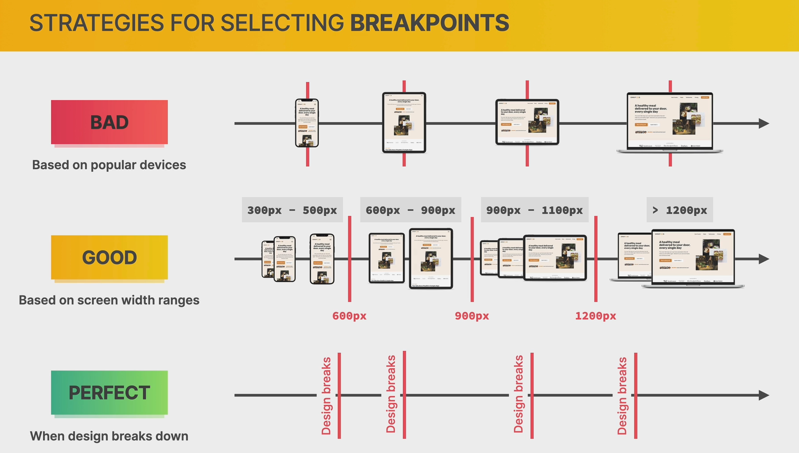

# Home Page

- [Home Page](#home-page)
  - [How Media Queries Work](#how-media-queries-work)
    - [Adding test media queries](#adding-test-media-queries)
  - [How to Select Breakpoints](#how-to-select-breakpoints)
  - [Responding to Small Laptops](#responding-to-small-laptops)
  - [Responding to Landscape Tablets](#responding-to-landscape-tablets)
    - [adding queries.css file](#adding-queriescss-file)
    - [Adding media queries](#adding-media-queries)
  - [Responding to Tablets](#responding-to-tablets)
    - [Adding media queries for tablets](#adding-media-queries-for-tablets)
  - [Building the Mobile Navigation](#building-the-mobile-navigation)
    - [Adding the markup](#adding-the-markup)
    - [Adding the styles](#adding-the-styles)
  - [Responding to Smaller Tablets](#responding-to-smaller-tablets)
    - [Adding the styles](#adding-the-styles-1)
  - [Responding to Phones](#responding-to-phones)
    - [Adding the styles for mobile](#adding-the-styles-for-mobile)

## How Media Queries Work


### Adding test media queries

```css
/**************************/
/* HERO SECTION */
/**************************/

.section-hero {
  background-color: #fdf2e9;
  padding: 4.8rem 0 9.6rem 0;
}

@media (max-width: 1200px) {
  .section-hero {
    background-color: orangered;
  }
}

@media (max-width: 600px) {
  .section-hero {
    border: 20px solid blue;
    background-color: blue;
  }
}
```


## How to Select Breakpoints



## Responding to Small Laptops

this is very important for responsive design

```html
<meta name="viewport" content="width=device-width, initial-scale=1.0" />
```

## Responding to Landscape Tablets

### adding queries.css file

```html
<link rel="stylesheet" href="css/queries.css" />
```

### Adding media queries

```css
/* rem and em do not depend on font size in media queries
instead 1rem = 1em = 16px 
*/

/* ***************************************** */
/* BELOW 1344 px (SMALLER DESKTOPS) */
@media (max-width: 84em) {
  .hero {
    max-width: 120rem;
  }

  .heading-primary {
    font-size: 4.4rem;
  }

  .gallery {
    grid-template-columns: repeat(2, 1fr);
  }
}

/* ***************************************** */
/* BELOW 1200 px (landscape tablets) */

@media (max-width: 75em) {
  html {
    /* 9/16*100 */
    font-size: 56.25%;
  }

  .grid {
    column-gap: 4.8rem;
    row-gap: 6.4rem;
  }
  .heading-secondary {
    font-size: 3.6rem;
  }

  .heading-tertiary {
    font-size: 2.4rem;
  }
  .header {
    padding: 0 3.2rem;
  }
  .hero {
    gap: 4.8rem;
  }

  .main-nav-list {
    gap: 3.2rem;
  }
  .testimonials-container {
    padding: 4.8rem;
  }
}

/* 

- Font sizes (px)
10 / 12 / 14 / 16 / 18 / 20 / 24 / 30 / 36 / 44 / 52 / 62 / 74 / 86 / 98 */
```

and add this to the stye file

```css
.main-nav-list {
  list-style: none;
  display: flex;
  align-items: center;
  gap: 4.8rem;
}
```

## Responding to Tablets

### Adding media queries for tablets

```css
.list-item {
  font-size: 1.8rem;
  display: flex;
  align-items: center;
  gap: 1.6rem;
  line-height: 1.2;
}

/* ***************************************** */
/* BELOW 940 px (tablets) */

@media (max-width: 59em) {
  html {
    /* 8/16*100 */
    font-size: 50%;
  }
  .hero {
    grid-template-columns: 1fr;
    padding: 0 8 rem;
    gap: 6.4rem;
  }

  .hero-img {
    width: 60%;
  }
  .hero-text-box,
  .hero-img-box {
    text-align: center;
  }
  .delivered-meals {
    justify-content: center;
    margin-top: 3.2rem;
  }
  .logos img {
    height: 2.4rem;
  }

  .step-number {
    font-size: 7.4rem;
  }
  .meal-content {
    padding: 2.4rem 3.2rem 3.2rem 3.2rem;
  }
  .section-testimonials {
    grid-template-columns: 1fr;
  }
  .gallery {
    grid-template-columns: repeat(6, 1fr);
  }
  .cta {
    grid-template-columns: 3fr 2fr;
  }
  .cta-form {
    grid-template-columns: 1fr;
  }
  .btn--form {
    margin-top: 1.2rem;
  }
}
/* 

- Font sizes (px)
10 / 12 / 14 / 16 / 18 / 20 / 24 / 30 / 36 / 44 / 52 / 62 / 74 / 86 / 98 */

/* --- 07 WHITESPACE

- Spacing system (px)
2 / 4 / 8 / 12 / 16 / 24 / 32 / 48 / 64 / 80 / 96 / 128
 
*/
```

## Building the Mobile Navigation

### Adding the markup

```html
<header class="header nav-open">
  <a href="#">
    
  </a>
  <nav class="main-nav">
    <ul class="main-nav-list">
      <li><a class="main-nav-link" href="#">How it works</a></li>
      <li><a class="main-nav-link" href="#">Meals</a></li>
      <li><a class="main-nav-link" href="#">Testimonials</a></li>
      <li><a class="main-nav-link" href="#">Pricing</a></li>
      <li><a class="main-nav-link nav-cta" href="#">Try for free</a></li>
    </ul>
  </nav>
  <button class="btn-mobile-nav">
    <ion-icon class="icon-mobile-nav" name="menu-outline"></ion-icon>
    <ion-icon class="icon-mobile-nav" name="close-outline"></ion-icon>
  </button>
</header>
```

### Adding the styles

```css
body {
  font-family: 'Rubik', sans-serif;
  line-height: 1;
  font-weight: 400;
  color: #555;
  overflow-x: hidden;
}

.header {
  display: flex;
  justify-content: space-between;
  align-items: center;
  background-color: #fdf2e9;
  position: relative;
  /* Because we want header to be sticky later */
  height: 9.6rem;
  padding: 0 4.8rem;
}

.btn-mobile-nav {
  border: none;
  background: none;
  cursor: pointer;
  display: none;
}
.icon-mobile-nav {
  height: 4.8rem;
  width: 4.8rem;
  color: #333;
}

.icon-mobile-nav[name='close-outline'] {
  display: none;
}

@media (max-width: 59em) {
  .btn-mobile-nav {
    display: block;
  }
  .main-nav {
    position: absolute;
    top: 0;
    left: 0;
    background-color: #fff;
    width: 100%;
    height: 100vh;
    transform: translateX(100%);
    display: flex;
    justify-content: center;
    align-items: center;
    transition: all 0.5s ease-in;
    /* hide the navigation */
    /* display: none; */
    /* allows no transitions */
    opacity: 0;
    /* make it inaccessible to mouse and keyboard */
    pointer-events: none;
    /* hide it from screen readers */
    visibility: hidden;
  }

  .nav-open .main-nav {
    opacity: 1;
    pointer-events: auto;
    visibility: visible;
    transform: translateX(0);
  }

  .nav-open .icon-mobile-nav[name='close-outline'] {
    display: block;
  }
  .nav-open .icon-mobile-nav[name='menu-outline'] {
    display: none;
  }
  .main-nav-list {
    flex-direction: column;
    gap: 4.8rem;
  }
  .main-nav-link:link,
  .main-nav-link:visited {
    font-size: 3.6rem;
  }
}
/* 

- Font sizes (px)
10 / 12 / 14 / 16 / 18 / 20 / 24 / 30 / 36 / 44 / 52 / 62 / 74 / 86 / 98 */

/* --- 07 WHITESPACE

- Spacing system (px)
2 / 4 / 8 / 12 / 16 / 24 / 32 / 48 / 64 / 80 / 96 / 128
 
*/
```

## Responding to Smaller Tablets

### Adding the styles

```css
/* ***************************************** */
/* BELOW 704 px (smaller tablets) */
@media (max-width: 44em) {
  .grid--3-cols,
  .grid--4-cols {
    grid-template-columns: repeat(2, 1fr);
  }
  .diets {
    grid-column: 1/-1;
    justify-self: center;
  }
  .heading-secondary {
    margin-bottom: 4.6rem;
  }
  .pricing-plan {
    width: 100%;
  }

  .grid--footer {
    grid-template-columns: repeat(6fr);
  }
  .logo-col,
  .address-col {
    grid-row: 2;
    grid-column: span 3;
  }
  .nav-col {
    grid-row: 1;
    grid-column: span 2;
    margin-bottom: 2.6rem;
  }
}
```

## Responding to Phones

### Adding the styles for mobile

```css
/* ***************************************** */
/* BELOW 544 px (phones) */
@media (max-width: 34em) {
  .grid {
    row-gap: 4.8rem;
  }
  .grid--2-cols,
  .grid--3-cols,
  .grid--4-cols {
    grid-template-columns: 1fr;
  }
  .hero {
    padding: 0 3.2rem;
  }

  .section-hero {
    padding: 2.4rem 0 6.4rem 0;
  }
  .btn,
  .btn:link,
  .btn:visited {
    padding: 2.4rem 1.6rem;
  }
  .hero-img {
    width: 80%;
  }

  .logos img {
    height: 1.2em;
  }
  .step-img-box:nth-child(2) {
    grid-row: 1;
  }
  .step-img-box:nth-child(6) {
    grid-row: 5;
  }
  .step-img-box {
    transform: translateY(2.4rem);
  }
  .section-how {
    padding: 0;
  }
  .testimonials {
    grid-template-columns: 1fr;
  }
  .gallery {
    grid-template-columns: repeat(4, 1fr);
    gap: 1.2rem;
  }
  .cta {
    grid-template-columns: 1fr;
  }
  .cta-img-box {
    grid-row: 1;
    height: 32rem;
  }
  .cta-text-box {
    padding: 3.2rem;
  }
}
```
