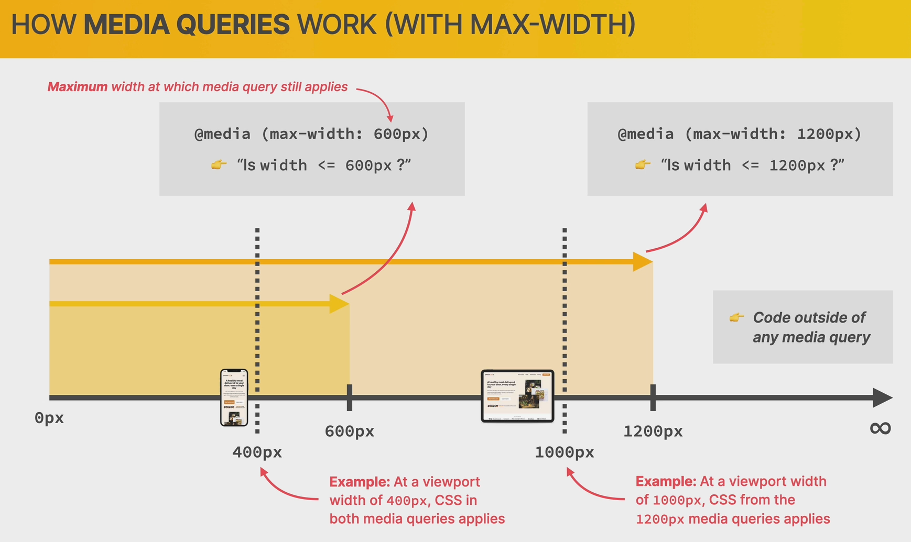
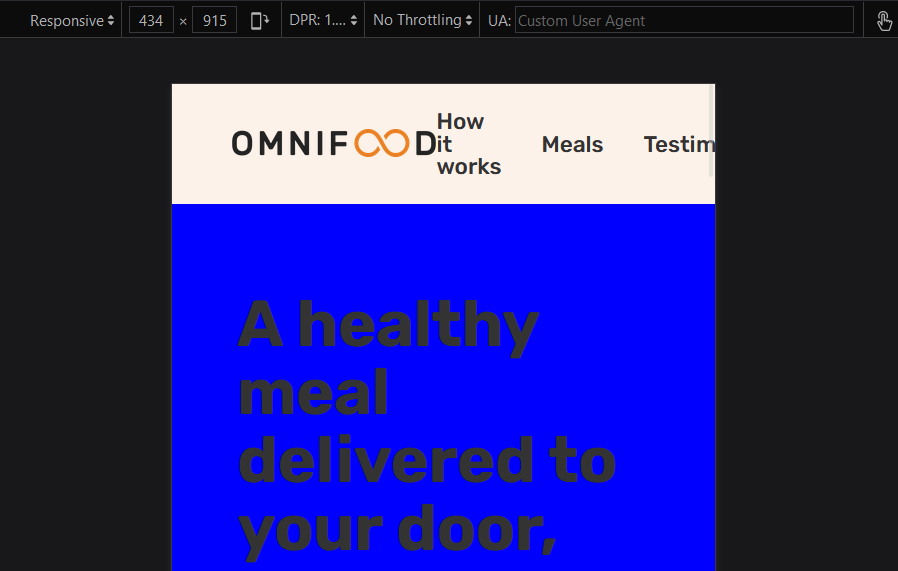

# Home Page

- [Home Page](#home-page)
  - [How Media Queries Work](#how-media-queries-work)
    - [Adding test media queries](#adding-test-media-queries)
  - [How to Select Breakpoints](#how-to-select-breakpoints)
  - [Responding to Small Laptops](#responding-to-small-laptops)
  - [Responding to Landscape Tablets](#responding-to-landscape-tablets)
  - [Responding to Tablets](#responding-to-tablets)
  - [Building the Mobile Navigation](#building-the-mobile-navigation)
  - [Responding to Smaller Tablets](#responding-to-smaller-tablets)
  - [Responding to Phones](#responding-to-phones)

## How Media Queries Work



### Adding test media queries

```css
/**************************/
/* HERO SECTION */
/**************************/

.section-hero {
  background-color: #fdf2e9;
  padding: 4.8rem 0 9.6rem 0;
}

@media (max-width: 1200px) {
  .section-hero {
    background-color: orangered;
  }
}

@media (max-width: 600px) {
  .section-hero {
    border: 20px solid blue;
    background-color: blue;
  }
}
```




## How to Select Breakpoints

## Responding to Small Laptops

## Responding to Landscape Tablets

## Responding to Tablets

## Building the Mobile Navigation

## Responding to Smaller Tablets

## Responding to Phones
