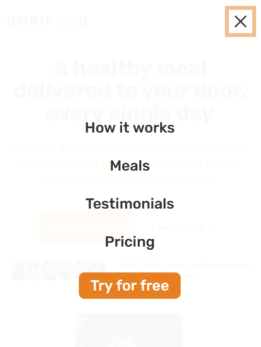

# Home Page

## Making the Mobile Navigation Work

### Adding the script file

```html
    </footer>
    <script src="./script.js"></script>
  </body>
```

### Adding js

```js
// MObile Navigation
const btnNavEl = document.querySelector('.btn-mobile-nav');
const headerEl = document.querySelector('.header');

btnNavEl.addEventListener('click', function () {
  headerEl.classList.toggle('nav-open');
});
```

```css
@media (max-width: 59em) {
  /* MOBILE NAVIGATION */
  .btn-mobile-nav {
    display: block;
    z-index: 999;
  }
}
```

### Output



## Implementing Smooth Scrolling

## Implementing a Sticky Navigation Bar

### Adding the styles

```css
.sticky .header {
  position: fixed;
  top: 0;
  left: 0;
  width: 100%;
  height: 8rem;
  padding-top: 0;
  padding-bottom: 0;
  background-color: rgba(255, 255, 255, 0.97);
  box-shadow: 0 1.2rem 3.6rem rgba(0, 0, 0, 0.03);
  z-index: 10000;
}

.sticky .section-hero {
  margin-top: 9.6rem;
}
```

### Adding the script

```js
// Smooth Scrolling animation

const allLinks = document.querySelectorAll('a:link');

allLinks.forEach(function (link) {
  link.addEventListener('click', function (e) {
    e.preventDefault();
    const target = this.getAttribute('href');

    if (target === '#') {
      window.scroll({
        top: 0,
        behavior: 'smooth',
      });
    }

    if (target !== '#' && target.startsWith('#')) {
      const sectionEl = document.querySelector(target);
      sectionEl.scrollIntoView({ behavior: 'smooth' });
    }

    if (link.classList.contains('main-nav-link')) {
      headerEl.classList.toggle('nav-open');
    }
  });
});

const heroEl = document.querySelector('.section-hero');
// Sticky Navigation
const obs = new IntersectionObserver(
  function (entries) {
    const ent = entries[0];
    if (!ent?.isIntersecting) {
      document.body.classList.add('sticky');
    }
    if (ent?.isIntersecting) {
      document.body.classList.remove('sticky');
    }
  },
  {
    // In the viewPort
    root: null,
    threshold: 0,
    rootMargin: '-80px',
  }
);

obs.observe(heroEl);
```

## Browser Support and Fixing Flexbox Gap in Safari

```css
  .main-nav {
    background-color: rgba(255, 255, 255, 0.507);
    backdrop-filter: blur(10px);
    -webkit-backdrop-filter: blur(10px);
```

```js
///////////////////////////////////////////////////////////
// Fixing flexbox gap property missing in some Safari versions
function checkFlexGap() {
  var flex = document.createElement('div');
  flex.style.display = 'flex';
  flex.style.flexDirection = 'column';
  flex.style.rowGap = '1px';

  flex.appendChild(document.createElement('div'));
  flex.appendChild(document.createElement('div'));

  document.body.appendChild(flex);
  var isSupported = flex.scrollHeight === 1;
  flex.parentNode.removeChild(flex);

  if (!isSupported) document.body.classList.add('no-flexbox-gap');
}
checkFlexGap();
```

## Testing Performance With Lighthouse

use the built in chrome dev tools to fix the issues

## Adding Favicon and Meta Description

generate the favicons using this [link](https://www.favicon-generator.org/) and add to the folders

```html
<meta name="viewport" content="width=device-width, initial-scale=1.0" />
<meta
  name="description"
  content="
    Omnifood is a AI powered food subscription service. that will make eat healthy again, 365 per year. It's 
    Tailored tp our personal tastes and nutritional needs.
    "
/>
<link rel="apple-touch-icon" sizes="57x57" href="/apple-icon-57x57.png" />
<link rel="apple-touch-icon" sizes="60x60" href="/apple-icon-60x60.png" />
<link rel="apple-touch-icon" sizes="72x72" href="/apple-icon-72x72.png" />
<link rel="apple-touch-icon" sizes="76x76" href="/apple-icon-76x76.png" />
<link
  rel="apple-touch-icon"
  sizes="114x114"
  href="./img/favicon/apple-icon-114x114.png"
/>
<link
  rel="apple-touch-icon"
  sizes="120x120"
  href="./img/favicon/apple-icon-120x120.png"
/>
<link
  rel="apple-touch-icon"
  sizes="144x144"
  href="./img/favicon/apple-icon-144x144.png"
/>
<link
  rel="apple-touch-icon"
  sizes="152x152"
  href="./img/favicon/apple-icon-152x152.png"
/>
<link
  rel="apple-touch-icon"
  sizes="180x180"
  href="./img/favicon/apple-icon-180x180.png"
/>
<link
  rel="icon"
  type="image/png"
  sizes="192x192"
  href="./img/favicon/android-icon-192x192.png"
/>
<link
  rel="icon"
  type="image/png"
  sizes="32x32"
  href="./img/favicon/favicon-32x32.png"
/>
<link
  rel="icon"
  type="image/png"
  sizes="96x96"
  href="./img/favicon/favicon-96x96.png"
/>
<link
  rel="icon"
  type="image/png"
  sizes="16x16"
  href="./img/favicon/favicon-16x16.png"
/>
<link rel="manifest" href="./img/favicon/manifest.json" />
<meta name="msapplication-TileColor" content="#ffffff" />
<meta name="msapplication-TileImage" content="/ms-icon-144x144.png" />
<meta name="theme-color" content="#ffffff" />
```

## Image Optimizations ## Deployment to Netlify ## Making the Form Work With

Netlify Forms

```

```
