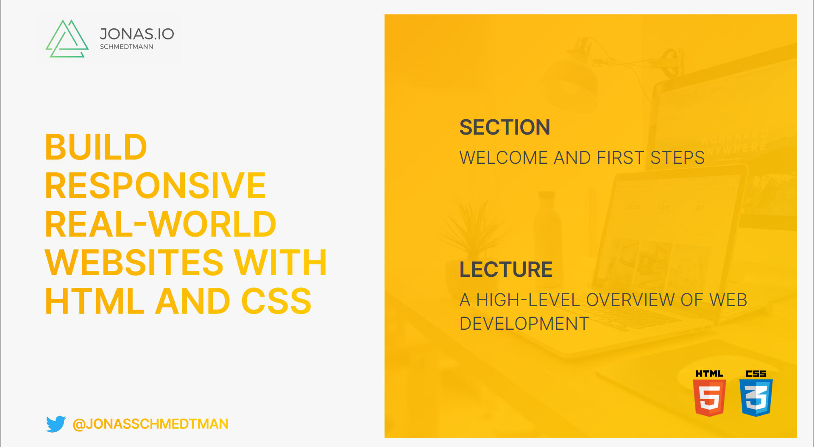
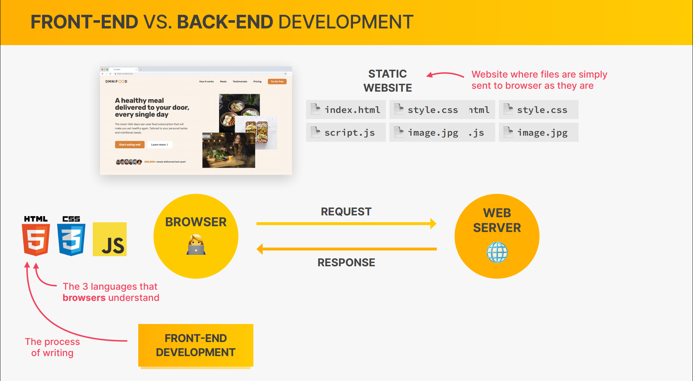
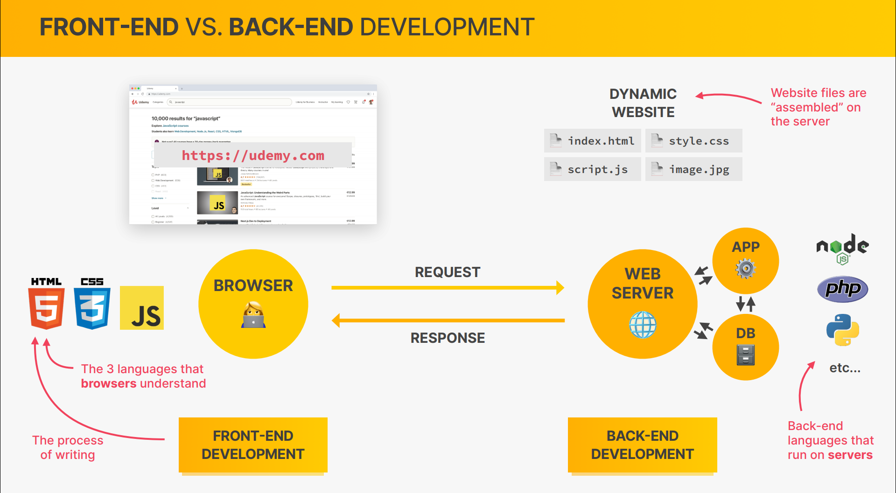
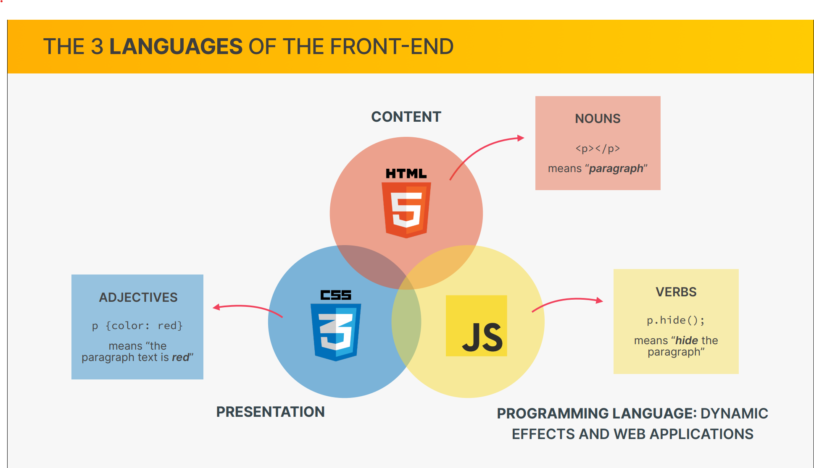
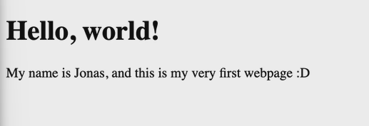

- [A High-Level Overview of Web Development](#a-high-level-overview-of-web-development)
- [Setting Up Our Code Editor](#setting-up-our-code-editor)
- [Your Very First Webpage!](#your-very-first-webpage)

### A High-Level Overview of Web Development






### Setting Up Our Code Editor

- install vs code
- set tab size to 2
- set auto save to onFocusChange
- install one monaki theme
- install auto close tag
- install auto rename tag
- install color highlight

### Your Very First Webpage!

let's create a webpage!

```html
<!DOCTYPE html>
<html lang="en">
  <head>
    <meta charset="UTF-8" />
    <meta http-equiv="X-UA-Compatible" content="IE=edge" />
    <meta name="viewport" content="width=device-width, initial-scale=1.0" />
    <title>my first webpage</title>
  </head>
  <body>
    <h1>Hello World!</h1>
    <p>my name is chamara. this is my first webpage</p>
  </body>
</html>
```


